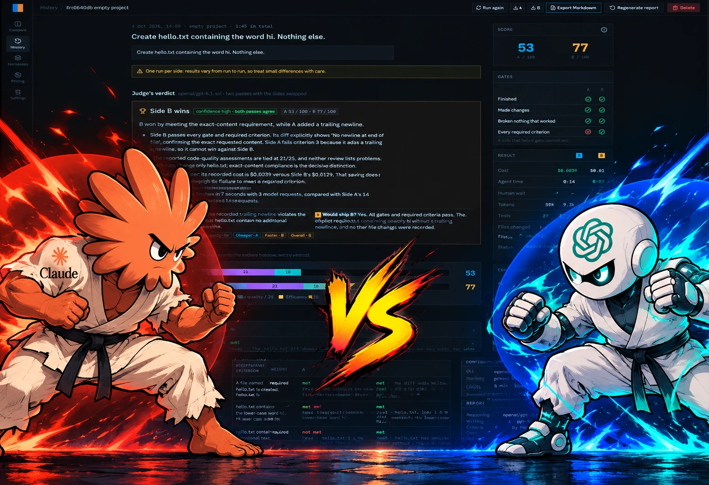

# ai-compare

A local, single-user tool for comparing AI coding agents side by side on your own projects: same prompt, same copy of the project, two configurations (CLI, provider, model, effort, mode). It measures cost, time and tokens, and produces a report.

## Run it

You only need [Docker Desktop](https://www.docker.com/products/docker-desktop/) (or Docker Engine with Compose).

```bash
git clone https://github.com/jmrona/ai-compare.git
cd ai-compare
docker compose up -d
```

Open **http://localhost:4700**. That is all: Node, Go and PostgreSQL run inside the containers, and no `.env` is required.

- **Stop:** `docker compose down` (your data stays in Docker volumes).
- **Update after pulling changes:** `docker compose up -d --build`.
- **API keys or ports:** copy `.env.example` to `.env` and edit it, then run `docker compose up -d` again.

### What works today

- **Real comparisons with opencode and OpenAI or Anthropic models.** Set `OPENAI_API_KEY` and/or `ANTHROPIC_API_KEY` in `.env`, enter the absolute path of a project (or start from an empty folder) and press **Run comparison**. Each side runs in its own container with a live terminal, and cost, tokens and time come from the inference proxy. The UI follows every change through a live event stream.
- **Verification:** when a side's agent ends, its changes are saved and the project's test command (plus optional hidden tests) runs in a fresh container without network. The Changes, Tests, Events and Metrics tabs show the result.
- **Reports:** a blind code review and an analysis of each side, then a comparative judgement, written by a configurable report model (`gpt-6-luna` by default) with its cost measured apart.
- **History survives restarts:** comparisons are saved in PostgreSQL; sides still running when `api` restarts are reattached. Terminals can be replayed with their original timing.
- **Download** each side's result as a zip named after its model, even after old containers and images have been cleaned up.
- **Models and prices** come from [models.dev](https://models.dev) (the Pricing page). **Settings** (report model, automatic reports, resources per side, retention) are saved in PostgreSQL.

Everything runs on real data, presets included: a side can run with the project's harness, a preset or no harness.

## Documentation

How everything works and why it was built this way: [`doc/`](doc/README.md). Start with the [architecture](doc/02-architecture.md).

## Repository layout

```
ai-compare/
  compose.yaml      entry point for `docker compose up`
  .env.example      optional shared configuration (backend, frontend and infra read the same .env)
  proto/            API contract (protobuf, Connect); buf.yaml and buf.gen.yaml are at the root
  backend/          Go API: orchestrator, inference proxy, terminals, Connect services, PostgreSQL
  frontend/         React + TypeScript + Tailwind + shadcn/ui, TanStack Router and Query
  infra/            Compose stack (api + postgres), volumes and Dockerfiles
  doc/              documentation: architecture, components, tools, decisions
  PLAN.md           product and technical plan
  mockups/          design mockups
```

## Development

These need only Docker:

| Command | What it does |
|---|---|
| `pnpm gen` | Regenerate the protobuf (Go and TypeScript) and sqlc code with pinned tools |
| `pnpm test` | Run the Go tests |

Working outside Docker requires Node.js 22+, pnpm 10+ and Go 1.26+:

| Command | What it does |
|---|---|
| `pnpm install` | Install frontend dependencies |
| `pnpm dev` | Frontend dev server at http://localhost:5173 |
| `pnpm build` | Type-check and build the frontend |
| `pnpm lint` | Lint the frontend (oxlint) |
| `pnpm backend:dev` | Run the Go API on the host, reading the root `.env` |
| `pnpm backend:test` | Run the Go tests |
| `pnpm db:up` | Start only PostgreSQL (published on 127.0.0.1:55432) |

## Configuration

All settings have defaults. A `.env` at the repo root overrides them:

- **Docker Compose** uses it for the containers and for values such as ports.
- **The Go backend** looks for it in the working directory and its parents when run on the host.
- **Vite** reads it through `envDir`; only `VITE_*` variables reach the browser. `pnpm dev` proxies `/api` to the backend on `APP_PORT`, so the dev server needs the backend running (in Docker or with `pnpm backend:dev`).
