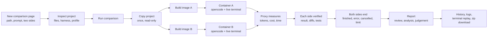

# 1. Product

## The problem

Choosing a coding agent setup (which CLI, which model, which reasoning effort, which instructions) is usually done by impression. Benchmarks use other people's code, and trying two setups by hand on your own project is slow, hard to keep fair and leaves no record of cost or time.

## What ai-compare does

ai-compare is a **local, single-user web app** that runs two coding-agent configurations **side by side on the user's own project** and measures them.

The user gives:

- an **absolute path** to a project on their machine, or nothing to start from an empty folder;
- **one prompt**, shared by both sides;
- for each side (A and B): **CLI** (`opencode`, later `codex` and `claude`), **provider**, **model**, **reasoning effort**, **mode** (autonomous or interactive) and optional **limits** (timeout, tokens, cost).

ai-compare then:

1. copies the project once, read-only, without `.env` secrets;
2. builds one Docker image per side with the project, the CLI and a Git baseline commit;
3. starts both containers at the same time, each with a live terminal in the browser;
4. routes every model request through its own proxy, which counts tokens, prices them with [models.dev](https://models.dev) and enforces limits;
5. records status, timings, logs, requests and a timed terminal recording, and keeps them in the history;
6. when a side's agent ends, saves its result (files, diffs, the CLI's session) and runs the project's tests, plus optional hidden tests, in a fresh container without network;
7. writes a report: a blind code review and an analysis of each side, then a comparative judgement.

Each side's result can be downloaded as a zip named after the model that produced it, even after its containers and images have been cleaned up.

## Principles

- **The original folder is never modified.** It is mounted read-only and copied; agents only ever work on the copy.
- **Results are throwaway.** Nothing is pushed anywhere. Copies have no Git remotes.
- **Fairness.** Both sides get the same copy, the same prompt, the same CPU and memory quota, start at the same moment and talk to the provider through the same proxy.
- **Measured, not estimated.** Tokens come from the provider responses as they pass through the proxy; prices come from models.dev, snapshotted when the comparison starts.
- **One command to run.** `docker compose up -d` is the only requirement. No Node, Go or Postgres on the host.
- **Local and private.** The UI listens on `127.0.0.1` only. API keys live only in the `api` container and never enter agent containers.

## Main flow

## Pages

| Route | Page | State today |
|---|---|---|
| `/` | New comparison: project path, inspection, profile, prompt, side A and side B forms | Real backend |
| `/comparisons/:id` | Run: two terminals side by side, tabs per side (Terminal, Logs, Changes, Metrics, Tests, Events, Preview), Finish, Cancel, Download, the report bar | Real backend; Changes is live while a side runs. Preview is disabled (phase 2) |
| `/history` | Ended comparisons grouped by date | Real backend |
| `/history/:id` | Comparison detail, report, per-side tabs with timed terminal replay, downloads of A and B, Delete | Real backend |
| `/harnesses` | Presets (create, edit, delete) | Preview on sample presets (phase 2) |
| `/pricing` | Models and prices from models.dev | Real backend |
| `/settings` | Report model, automatic report, default limits, resources per side, retention, clean-up, disk use, CLI versions | Real backend |
| `/spike/terminal` | Hidden page from phase 0: a throwaway bash container in the browser | Real backend |

## Scope by phase

| Phase | Content | State |
|---|---|---|
| **0 — Stack and spike** | Docker Compose stack, Go server, frontend with mocks, Postgres with migrations, protobuf contract, and a spike proving: copy from the host, side image build, network isolation, browser TTY, opencode through the proxy, usage and cost extraction, reaching the host for local models | Done (macOS still to be checked by hand) |
| **1 — OpenAI models with the project's harness** | `opencode` only, OpenAI only, the project's own harness. 1a: launch and watch, reconnection. 1b: Changes tab, metrics, history with recordings, test verification, blind report, settings | Done (3 Oct 2026; macOS still to be checked by hand) |
| **2 — Presets, previews and repetitions** | Still opencode only: Anthropic as a second provider; presets and "no harness"; app previews; N repetitions per side; preset adviser | In progress: Anthropic done |
| **3 — More CLIs and local models** | Local models for opencode; `claude` (Anthropic only) and `codex` (OpenAI only) CLIs | Not started |

## CLI and provider combinations

Each CLI only uses the providers it speaks natively. ai-compare does not translate between APIs.

| CLI | OpenAI | Anthropic | Local models | Phase |
|---|---|---|---|---|
| `opencode` | Yes | Yes | Yes (OpenAI-compatible) | 1 (OpenAI), 2 (Anthropic), 3 (local) |
| `codex` | Yes | No | No | 3 |
| `claude` | No | Yes | No | 3 |

## Out of scope

- Pushing, merging or publishing the code an agent writes.
- Modifying the original project or the host's global CLI configuration.
- Multiple users, accounts, authentication, hosted deployment.
- Mass comparisons of many models at once.
- Claiming that a rule in a harness caused a result from a single run per side.
