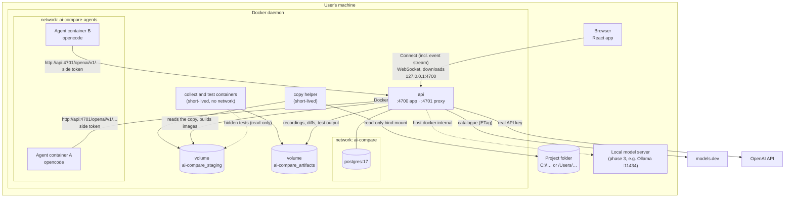
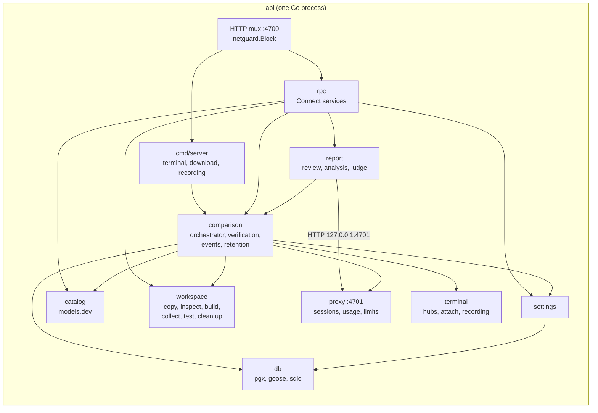
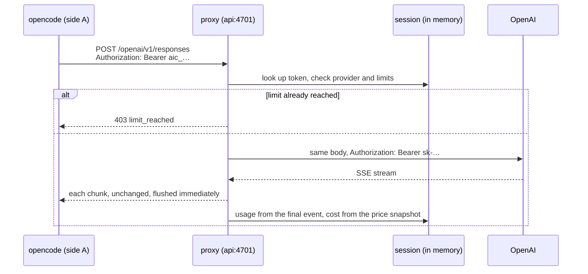

# 2. Architecture

## The pillars

ai-compare is a small number of processes. Everything runs in Docker on the user's machine.

| Pillar | What it is | Where it runs |
|---|---|---|
| **Browser** | The React app (built with Vite) | The user's browser, served by `api` at `http://localhost:4700` |
| **`api`** | One Go binary with two HTTP listeners: the app (UI, API, terminals) on **4700** and the **inference proxy** on **4701** | Container `ai-compare-api-1` (Compose service `api`) |
| **Docker daemon** | The host's Docker, reached through the mounted socket | Host |
| **Copy helper** | A short-lived Alpine container that reads the user's folder and copies it into the staging volume | Created by `api` per copy or inspection |
| **Agent containers** | One per side, running the CLI with a TTY on a copy of the project, as the user `agent` | Created by `api` per comparison |
| **Verification containers** | Short-lived containers of each side's result image: one collects the result, one or two run the tests. No network | Created by `api` when a side's agent ends |
| **PostgreSQL** | Stores comparisons, sides, reports and settings | Compose service `postgres` |
| **models.dev** | Public catalogue of models and prices | Internet |
| **Providers** | OpenAI today; Anthropic and local servers later | Internet, or the host for local models |

## Overview

`api` is attached to both networks. It is the **only** service on `ai-compare-agents`, so agents can reach the proxy and the internet but not Postgres, and requests from that network to the app port are refused (see [Networking and security](08-networking-and-security.md)).

## How the pillars communicate

| From → To | Channel | What travels | Details |
|---|---|---|---|
| Browser → api | HTTP on `127.0.0.1:4700` | Static files of the built frontend | Served from `/app/web`, with an SPA fallback to `index.html` |
| Browser → api | **Connect** (protobuf over HTTP, JSON encoding) under `/api/rpc/` | Catalogue, projects, comparisons, diffs, tests, events, reports, settings | Read-only methods go as HTTP GET. See [API and contracts](10-api-and-contracts.md) |
| api → browser | **Connect server stream** `EventService.Watch` | Every change of a comparison (coalesced every 250 ms; running ones republished every second), deletions, heartbeats | Replaces polling; the browser keeps one stream open |
| Browser ↔ api | **WebSocket** `/api/comparisons/{id}/sides/{side}/terminal` | Terminal output (binary), keystrokes (binary), resize (JSON text) | Same-origin only. See [Terminals](07-terminals.md) |
| Browser → api | Plain HTTP GET `…/sides/{side}/download` and `…/recording` | A side's files as a zip; its asciicast recording | Files, not messages, so they stay outside Connect |
| api → Docker | Docker Engine API over the mounted socket (`/var/run/docker.sock`) | Build and commit images, create, attach, start, resize, exec, stop and remove containers, read logs and files | Go client `github.com/moby/moby/client` |
| api → copy helper | Container arguments, exit codes, stdout JSON | The path to copy, the comparison id and destination (`project` or `hidden`); the result summary | Exit 3 = path not found, 4 = not readable/shared |
| api → agent container | TTY attach (stdin/stdout stream), environment variables, files in the image, `docker exec` | Prompt and CLI config are baked into the image; the side token is an env var; the live diff is read with `git` through exec | |
| api → verification containers | Container command, mounts of the artefacts and staging volumes, logs | `collect-result.sh`; the profile's test command | Run once without network and removed |
| Agent container → api | HTTP to `http://api:4701/<provider>/…` | Model requests with the side token as API key | The proxy forwards to the provider with the real key |
| api (report) → api (proxy) | HTTP to `http://127.0.0.1:4701/openai/v1/responses` | Report stages, with a proxy session of their own | So the report's cost is measured apart |
| api → providers | HTTPS | Model requests and responses, unchanged | Usage is read from responses as they stream back |
| api → models.dev | HTTPS with `If-None-Match` | `api.json` (~5 MB, ~380 KB gzip) | Cached on disk; refreshed every 24 h or on demand |
| api → npm registry | HTTPS | The latest published opencode version, for the Settings page | At most once an hour |
| api ↔ Postgres | pgx connection pool on the `ai-compare` network | Comparisons, sides, reports, settings | Migrations applied at startup |

## Inside `api`

| Package | Responsibility |
|---|---|
| `cmd/server` | Wiring: config, catalogue, proxy, database, settings, Docker client, comparison and report services, the retention loop, routes, the two HTTP servers, graceful shutdown. Also the plain HTTP routes (terminal, download, recording) and the tar-to-zip conversion |
| `internal/config` | Reads settings from the environment and the root `.env` |
| `internal/catalog` | Downloads, filters, sorts and caches the models.dev catalogue |
| `internal/proxy` | The inference proxy: sessions (new and restored after a restart), forwarding, usage parsing, cost, limits |
| `internal/workspace` | Talks to Docker for project work: inspect and copy projects and hidden tests, list folders, build side images, commit result images, collect results (`collect-result.sh`), run tests, live diff through `exec`, remove a comparison's Docker objects, disk use |
| `internal/comparison` | The orchestrator: runs both sides, follows them, verifies their result, tracks status and metrics, persists them, publishes events, reattaches after a restart, applies retention and deletion |
| `internal/report` | The report: blind review and analysis per side, comparative judgement, through the proxy with the report model |
| `internal/settings` | The editable settings (report model, automatic report, default limits, resources, retention), saved in Postgres |
| `internal/terminal` | Container attach, the per-side hub (buffer, viewers, input times), the asciicast recorder and the WebSocket bridge |
| `internal/netguard` | Refuses app-port requests coming from the agent network |
| `internal/rpc` | Implementations of the Connect services and the conversion of Go types to protobuf messages |
| `internal/db` | Migrations, connection, generated queries |
| `internal/gen` | Code generated from `proto/` (do not edit) |

## A request's journey: one model call

## Concurrency model

- Each comparison runs in its own goroutine. The copy happens once; then each side runs in its own goroutine (build, create, attach, start, wait, verify).
- Each running side has a watcher that checks its proxy session every 2 s, stops the side when a token or cost limit is hit, and saves the side every 10 s.
- A single mutex in the comparison service protects the in-memory state of every comparison. Saves to Postgres are serialised per side so an older state never overwrites a newer one.
- Changes are published through an in-process event bus: a publisher goroutine sends the comparisons that changed every 250 ms, plus the running ones every second, to every subscriber (one per open event stream). A subscriber that falls behind is dropped and reconnects.
- The report service runs its stages in goroutines; the per-side stages of both sides run in parallel.
- A retention goroutine runs the clean-up at startup and every hour.
- Each terminal hub has its own mutex and one channel per viewer.

## State

| State | Where | Survives an `api` restart? |
|---|---|---|
| Comparisons and sides (config, status, outcome, failure kind, timings, prices, logs, proxy requests, result, input times, terminal output) | Memory, saved to Postgres on every status change, every 10 s while running and at the end | Yes |
| Live proxy sessions and tokens | Memory; a running side's token is also saved | Yes for sides whose container is still running: they are restored with the same token. Other tokens are gone |
| Terminal hubs | Memory, output saved at the end of each side | Output yes; a reattached side's screen is rebuilt from `docker logs` |
| Recordings, result files, diffs, CLI sessions, test output | Volume `ai-compare_artifacts`, under `<id>/<side>` | Yes; retention removes them only when the user selects artefacts |
| Reports | Postgres (`comparisons.report`, `report_status`) | Yes; a report still being generated becomes an error |
| Settings | Postgres (`settings`) | Yes |
| models.dev catalogue | Memory and `DATA_DIR/catalog.json` (volume `appdata`) | Yes |
| Project copies and hidden tests | Volume `ai-compare_staging` | Yes, until retention |
| Side images, result images and stopped containers | Docker | Yes, until retention |
