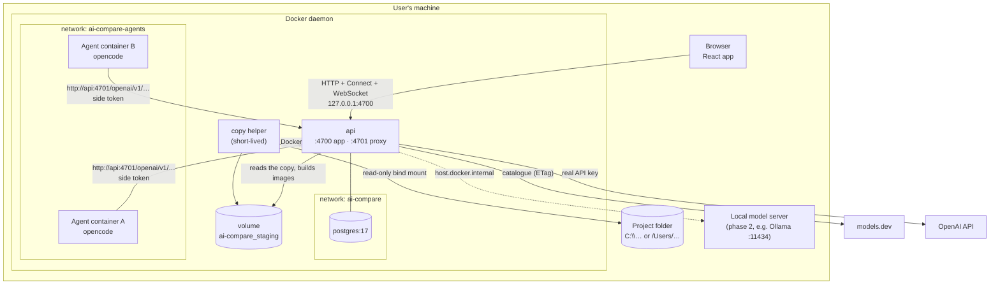
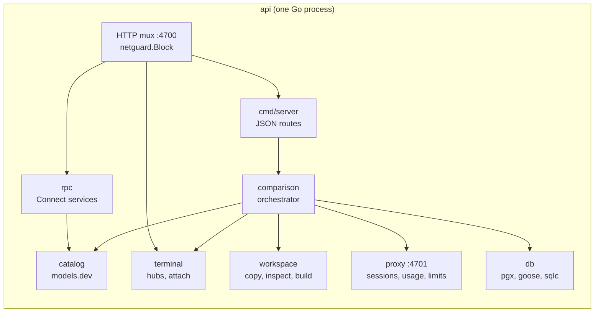
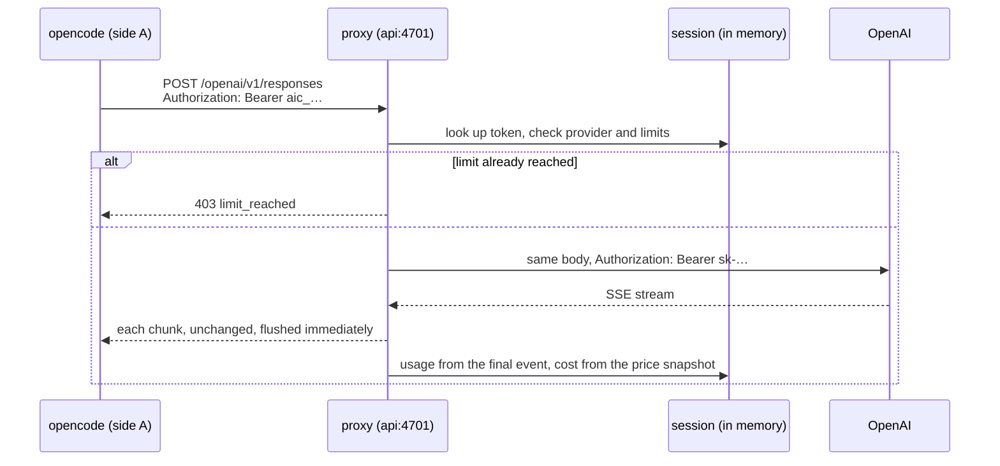

# 2. Architecture

## The pillars

ai-compare is a small number of processes. Everything runs in Docker on the user's machine.

| Pillar | What it is | Where it runs |
|---|---|---|
| **Browser** | The React app (built with Vite) | The user's browser, served by `api` at `http://localhost:4700` |
| **`api`** | One Go binary with two HTTP listeners: the app (UI, API, terminals) on **4700** and the **inference proxy** on **4701** | Container `ai-compare-api-1` (Compose service `api`) |
| **Docker daemon** | The host's Docker, reached through the mounted socket | Host |
| **Copy helper** | A short-lived Alpine container that reads the user's folder and copies it into the staging volume | Created by `api` per copy or inspection |
| **Agent containers** | One per side, running the CLI with a TTY on a copy of the project | Created by `api` per comparison |
| **PostgreSQL** | Stores comparisons and sides | Compose service `postgres` |
| **models.dev** | Public catalogue of models and prices | Internet |
| **Providers** | OpenAI today; Anthropic and local servers later | Internet, or the host for local models |

## Overview

`api` is attached to both networks. It is the **only** service on `ai-compare-agents`, so agents can reach the proxy and the internet but not Postgres, and requests from that network to the app port are refused (see [Networking and security](08-networking-and-security.md)).

## How the pillars communicate

| From → To | Channel | What travels | Details |
|---|---|---|---|
| Browser → api | HTTP on `127.0.0.1:4700` | Static files of the built frontend | Served from `/app/web`, with an SPA fallback to `index.html` |
| Browser → api | **Connect** (protobuf over HTTP, JSON encoding) under `/api/rpc/` | Catalogue, project inspection, folder browser | Read-only methods go as HTTP GET. See [API and contracts](10-api-and-contracts.md) |
| Browser → api | JSON over HTTP under `/api/` | Starting comparisons, status, logs, finish/cancel, zip download | Moving to Connect service by service |
| Browser ↔ api | **WebSocket** `/api/comparisons/{id}/sides/{side}/terminal` | Terminal output (binary), keystrokes (binary), resize (JSON text) | Same-origin only. See [Terminals](07-terminals.md) |
| api → Docker | Docker Engine API over the mounted socket (`/var/run/docker.sock`) | Build images, create, attach, start, resize, stop containers, read files | Go client `github.com/moby/moby/client` |
| api → copy helper | Container arguments, exit codes, stdout JSON | The path to copy, the comparison id; the result summary | Exit 3 = path not found, 4 = not readable/shared |
| api → agent container | TTY attach (stdin/stdout stream), environment variables, files in the image | Prompt and CLI config are baked into the image; the side token is an env var | |
| Agent container → api | HTTP to `http://api:4701/<provider>/…` | Model requests with the side token as API key | The proxy forwards to the provider with the real key |
| api → providers | HTTPS | Model requests and responses, unchanged | Usage is read from responses as they stream back |
| api → models.dev | HTTPS with `If-None-Match` | `api.json` (~5 MB, ~380 KB gzip) | Cached on disk; refreshed every 24 h or on demand |
| api ↔ Postgres | pgx connection pool on the `ai-compare` network | Comparisons and sides | Migrations applied at startup |

## Inside `api`

| Package | Responsibility |
|---|---|
| `cmd/server` | Wiring: config, catalogue, proxy, database, Docker client, routes, the two HTTP servers, graceful shutdown |
| `internal/config` | Reads settings from the environment and the root `.env` |
| `internal/catalog` | Downloads, filters, sorts and caches the models.dev catalogue |
| `internal/proxy` | The inference proxy: sessions, forwarding, usage parsing, cost, limits |
| `internal/workspace` | Talks to Docker to inspect and copy projects and to build side images |
| `internal/comparison` | The orchestrator: runs both sides, tracks status and metrics, persists them |
| `internal/terminal` | Container attach, the per-side hub and the WebSocket bridge |
| `internal/netguard` | Refuses app-port requests coming from the agent network |
| `internal/rpc` | Implementations of the Connect services |
| `internal/db` | Migrations, connection, generated queries |
| `internal/gen` | Code generated from `proto/` (do not edit) |

## A request's journey: one model call

## Concurrency model

- Each comparison runs in its own goroutine. The copy happens once; then each side runs in its own goroutine (build, create, attach, start, wait).
- Each side has a limit watcher that polls its proxy session every 2 s and stops the side when a token or cost limit is hit.
- A single mutex in the comparison service protects the in-memory state of every comparison. Saves to Postgres are serialised per side so an older state never overwrites a newer one.
- Each terminal hub has its own mutex and one channel per viewer.

## State

| State | Where | Survives an `api` restart? |
|---|---|---|
| Comparisons and sides (config, status, timings, prices, logs, proxy requests, terminal output) | Memory, saved to Postgres on every status change and at the end | Yes |
| Live proxy sessions and tokens | Memory | No: tokens are revoked; running sides are closed as errors |
| Terminal hubs | Memory, output saved at the end of each side | Output yes (read-only replay) |
| models.dev catalogue | Memory and `DATA_DIR/catalog.json` (volume `appdata`) | Yes |
| Project copies | Volume `ai-compare_staging` | Yes |
| Side images and stopped containers | Docker | Yes (the zip download reads the stopped container) |
