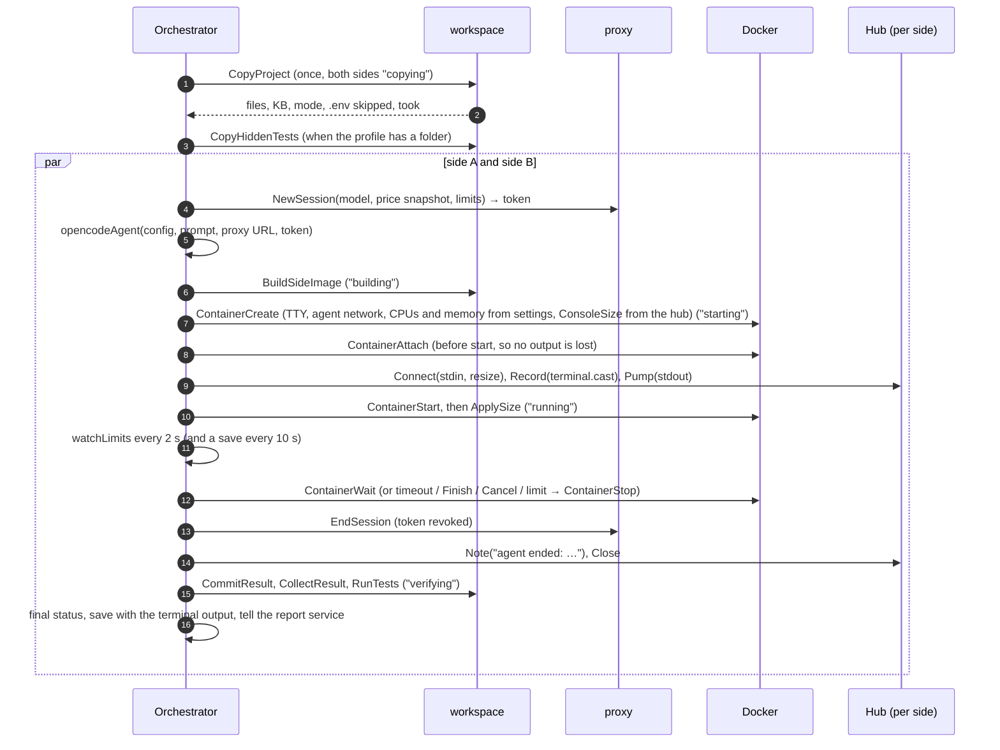
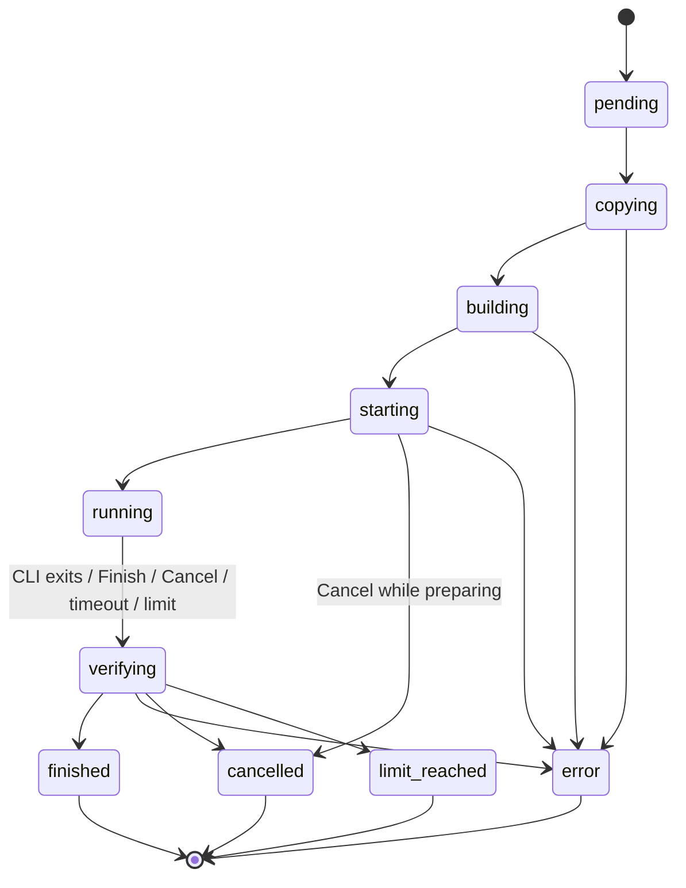

# 4. Comparison lifecycle

Code: `backend/internal/comparison/`: `comparison.go` (types, starting, Finish/Cancel, views), `run.go` (preparing and following a side), `verify.go` (after the agent ends), `store.go` (persistence and restarts), `events.go` (the event bus), `timeline.go` (CLI sessions), `human.go` (human wait), `retention.go` (clean-up and deletion), `agent.go` (the opencode adapter). API: `ComparisonService` in `backend/internal/rpc/comparison.go`; the plain HTTP routes in `backend/cmd/server/comparisons.go`.

## Before the run: inspecting the project

The project is **optional**: the New comparison page offers "Copy a folder" or "Empty folder". With an empty folder there is nothing to inspect, the profile is the default runtime with no commands, and both sides start from an empty `/workspace` (the copy step only creates the empty folder).

When the user types a path, or picks one with **Browse…** (see [Project copy and side images](05-project-copy-and-images.md#the-folder-browser)), the browser calls `ProjectService.InspectProject`. `api` runs the copy helper with `inspect-project` (see [Project copy and side images](05-project-copy-and-images.md)), which reports without copying:

- whether it is a Git repository, how many files would be copied and their size;
- harness files at the root, and which CLI reads each one (`AGENTS.md` → opencode and codex, `CLAUDE.md` → claude…);
- `.env` files that will be left out;
- toolchain markers, from which `detectProfile` proposes a **profile**: runtime `node:22-bookworm-slim` and, depending on the lock file, a setup command (`npm ci`, `pnpm install --frozen-lockfile`, `yarn install --frozen-lockfile`) and a test command.

The profile is editable, and also takes an optional **hidden tests** folder: tests the agents never see, used only to verify their results.

The runtime must contain Node.js for now, because opencode is installed with npm.

## Starting

`ComparisonService.StartComparison` with (Connect JSON shown):

```json
{
  "projectPath": "C:\\Users\\me\\projects\\app",
  "profile": { "runtime": "node:22-bookworm-slim", "setup": "npm ci", "test": "npm test", "hiddenTestsPath": "C:\\Users\\me\\hidden-tests" },
  "prompt": "Add a CSV export to the invoices page",
  "a": { "cli": "opencode", "provider": "openai", "model": "gpt-5.4-nano", "effort": "low", "mode": "autonomous",
         "limits": { "timeoutMin": 10, "maxCostUsd": 0.5 } },
  "b": { "cli": "opencode", "provider": "openai", "model": "gpt-5.4-mini", "effort": "low", "mode": "autonomous",
         "limits": {} }
}
```

`Service.Start` validates (non-empty prompt, two models, `opencode` and `openai` only in phase 1, a known mode), creates an id (`r` + 6 hex characters), creates both sides with status `pending` and a terminal hub each, **inserts them into Postgres**, publishes the new comparison on the event stream, starts `run` in a goroutine and returns `{"id": "…"}` at once. The browser navigates to `/comparisons/{id}` and follows the run through `EventService.Watch` (see [API and contracts](10-api-and-contracts.md)).

## The run



If the hidden tests cannot be copied, the comparison carries on without them and both sides log a warning.

Step by step, per side (`runSide`, `follow`, `verify`):

1. **Price snapshot and proxy session.** The model's price (and long-context tier) is copied from the current catalogue into the side, and a proxy session is created with the limits converted to absolute numbers (`maxTokensK × 1000`, `maxCostUsd`). The session returns a random `aic_…` token.
2. **Agent definition.** `opencodeAgent` produces the install command, the config file to put in the agent's home folder, the environment (`OPENAI_API_KEY=<token>`) and the command line. See [Agent CLIs](13-agent-clis.md).
3. **Image build** (`building`). One image per side, tagged `ai-compare/side:<id>-<side>`. Both sides build in parallel; Docker's layer cache makes the second build and later comparisons fast.
4. **Container creation** (`starting`). TTY with stdin open, on the agent network, with the CPUs and memory from settings (2 CPUs and 4 GB by default, the same for both sides), and labels `ai-compare.comparison`, `ai-compare.side`, `ai-compare.role=agent`. `ConsoleSize` is set from the size the browser terminal already reported, so the TUI draws for the right size from its first frame.
5. **Attach, then start.** Attaching before starting guarantees the first output is captured; the hub records it to `terminal.cast` from then on. After the start, the latest browser size is applied once more, in case the user resized while the container was starting.
6. **Running.** `runStartedAt` is recorded. The limit watcher starts. The orchestrator waits for the container to exit, or for the run context to end.
7. **The agent stops.** Whatever stops it, the **outcome** is decided (the first decision wins), the container is stopped if still running, the attach is closed, the proxy token is revoked, a final note is written to the terminal and the hub is closed.
8. **Verification** (`verifying`). See [Verification](#verification).
9. **Final status.** The side takes its outcome as its status, is saved with its terminal output, and the report service is told (see [Reports](#reports)).

If the user presses Finish or Cancel while a side is still being prepared (before step 6), the side ends at once with that status and the remaining steps are skipped.

## Statuses



(Cancel and Finish end a side from `pending`, `copying`, `building` or `starting` alike, as `cancelled` or `finished`; only one arrow is drawn.)

| What stops a running agent | Outcome | End reason | Failure kind |
|---|---|---|---|
| The CLI exits with code 0 | `finished` | "The CLI exited (code 0)" | |
| The CLI exits with another code | `error` | "The CLI exited with code N" | `agent` |
| Finish | `finished` | "Finished by the user" | |
| Cancel | `cancelled` | "Cancelled by the user" | |
| Timeout | `limit_reached` | "Timeout of N min" | |
| Token or cost limit | `limit_reached` | "The token limit was reached", "The cost limit was reached" | |
| Docker loses track of the container | `error` | "lost track of the container: …" | `infrastructure` |

- `finished`, `error`, `cancelled` and `limit_reached` are **final**. When the agent stops, the outcome is decided once: if the user presses Finish and the container then exits with code 137, the side still ends `finished`. The side passes through `verifying` and then takes the outcome as its status.
- A failure while preparing (copy, proxy session, build, create, attach, start) ends the side at once as `error` with failure kind **`infrastructure`**, prints the error in red in its terminal and logs it. A side that was being prepared when `api` restarted, or whose container disappeared during a restart, ends the same way.
- **Finish** and **Cancel** (`ComparisonService.FinishSide` and `CancelSide`) record the outcome first, then cancel the run context, which stops the container.
- **Timeout** is a deadline on the run context, counted from `runStartedAt`. **Token and cost limits** are detected by the watcher from the proxy session; the proxy itself already answers 403 to further requests.

## Verification

`verify.go` runs as soon as a side's agent has stopped. The Docker work is in `backend/internal/workspace/result.go`; [Project copy and side images](05-project-copy-and-images.md#after-the-agent-result-image-collection-and-tests) describes the containers involved.

1. **Commit.** The stopped agent container is committed to the image `ai-compare/result:<id>-<side>` (labels `ai-compare.comparison`, `ai-compare.side`, `ai-compare.role=result`).
2. **Collect.** `collect-result.sh` runs in a container of that image, as root and without network, and writes to `<id>/<side>/` in the artefacts volume:
   - `workspace.tar`: the files the agent left, without `.git` and `node_modules`;
   - `solution.diff` and `solution.numstat`: changes against `baseline`, harness files and dependency folders excluded;
   - `dependencies.count`: how many changed files were inside dependency folders (`node_modules`, `bower_components`, `.venv`, `venv`, `__pycache__`, `.pytest_cache`, `.mypy_cache`, `.ruff_cache`, `.next`, `.nuxt`, `.turbo`, `.parcel-cache`, `.cache`, `.gradle`, `.pnpm-store`). An agent that runs `npm install` in a project without a `.gitignore` would otherwise show hundreds of installed files as its work;
   - `harness.diff` and `harness.numstat`: changes to harness files only;
   - `session.json`: opencode's sessions (`opencode session list`, then `opencode export` of each).
3. **Facts.** The changed files and harness files (with lines added and removed) go into the side's result. The CLI session's own token count is compared with the proxy's in a `verify` log line; the proxy's figure is the one used, since it also sees requests the CLI does not count (such as session titles).
4. **Tests.** When the profile has a test command and the side was not cancelled, it runs in a **fresh container of the result image**, as the `agent` user, without network, with a 10-minute timeout. The output is saved to `tests-visible.log`. If the comparison has hidden tests, a second run copies `/staging/<id>/hidden` into `/workspace` first and saves `tests-hidden.log`. Each run is `passed` (exit 0), `failed` (another exit code) or `error` (it could not run, or timed out). Without a test command, or for a cancelled side, the tests are skipped with a reason.
5. **Interactive sides:** the human wait is computed (see [Timings and metrics](#timings-and-metrics)).
6. The time all of this took is recorded as `phases.verifySec`.

A side that never got a container (it failed or was ended while being prepared) has nothing to verify.

### Changes while a side runs

While a side is `running`, `GetDiff` reads its changes live: `docker exec` runs `git` in the agent container with a temporary index (`GIT_INDEX_FILE`), so the agent's own index is never touched. Once the side has ended, `GetDiff` reads the saved `solution.diff` or `harness.diff`. Dependency folders are left out in both cases (and filtered again when reading, for results collected before this rule) and returned only as a count (`dependency_files`). Diffs longer than 20,000 lines are truncated.

### Events

`GetTimeline` parses `session.json` once the side has ended: the prompt, the agent's messages, each tool call with a summary of its main argument (command, file path, pattern…), patches with the files they changed, and errors. It also returns the session's own tokens and cost, which the Events tab shows as a cross-check against the proxy.

## Timings and metrics

| Metric | Definition |
|---|---|
| `elapsedSec` | From the creation of the comparison to the end of the side (or now) |
| `prepSec` | From creation to `runStartedAt`: copy + build + start. Not counted against the agent |
| `phases.copySec` | Duration of the shared copy (same value on both sides) |
| `phases.buildSec` | Duration of this side's image build |
| `phases.startSec` | Container create + attach + start |
| `phases.verifySec` | Commit, collection and tests after the agent stopped |
| `agentSec` | From `runStartedAt` to the moment the agent stopped, minus the human wait |
| `humanWaitSec` | Interactive mode only; see below |
| `usage`, `costUsd` | Sum over the proxy session's requests (see [Inference proxy](06-inference-proxy.md)) |
| `requests`, `errors` | Count of proxied requests, and those with a provider error or status ≥ 400 |
| `tokensPerSec` | Output tokens of streamed requests divided by their duration, once there is more than 1 s of data |
| `files`, `harnessFiles` | Files changed, with lines added and removed, from the numstat files |

**Human wait.** The hub records when the user types into a side's terminal (at most one time per second). The proxy's requests are merged into busy intervals; every gap between them, from the start of the run to the end of the agent, that contains user input counts as human wait. A gap without input is the agent working locally and stays agent time. It is a heuristic: it cannot tell a user reading the screen from an agent thinking without calling the model.

## Logs

Each side keeps log entries (`at`, `level`, `source`, `message`) with source `copy`, `build`, `run`, `verify` or `proxy`. The orchestrator writes notes at each step (files copied, image built in N s, container started with its resources, files changed, tests passed…); informational notes are also printed in the side's terminal in grey with the prefix `[ai-compare]`. `GetLogs` merges them with one line per proxied request, sorted by time.

## Downloading the result

`GET /api/comparisons/{id}/sides/{side}/download` streams the side's files as a zip named `<model>-<id>-<side>.zip`, leaving out `.git` and `node_modules`:

- once the side has been verified, from the saved `workspace.tar` in the artefacts volume, so it keeps working after retention has removed the containers and images;
- before that, from the running container's `/workspace` through `CopyFromContainer`.

`GET …/recording` returns the side's `terminal.cast` (see [Terminals](07-terminals.md)).

## Reports

Once both sides have ended, the user can press **Generate report** (`ReportService.GenerateReport`). With automatic reports on in `/settings` (off by default), each side's blind review and analysis start as soon as that side ends, and the comparative judgement runs when the second one ends. The report's status (`none`, `generating`, `ready`, `error`) is part of the comparison and arrives through the event stream. Code: `backend/internal/report/`; the stages are described in [Models and pricing](09-models-and-pricing.md#the-report-model) and how they reach the model in [Inference proxy](06-inference-proxy.md#report-sessions).

## Persistence and restarts

A side is saved (`store.go`) on every status change, every 10 s while it runs (so a restart loses at most that much of its proxy requests) and when it ends, this time with its terminal output. A running side's proxy token is saved too, and emptied when the side ends. On startup, `Load`:

1. reads all comparisons and sides from Postgres. Ended sides get a closed hub pre-filled with their saved terminal output, so the history shows the final screen;
2. **reattaches** sides that were `running` and whose container still runs: the proxy session is restored with the same token and the saved requests (`proxy.RestoreSession`), the terminal is rebuilt from `docker logs`, the recording is completed with the output produced since the last save, and the side is followed as before (timeout, limits, verification);
3. **verifies** sides whose agent ended while `api` was down, or whose verification was interrupted; the outcome comes from the container's exit code;
4. ends sides that were being prepared (`pending` to `starting`) as `error` with failure kind `infrastructure` and the reason "ai-compare restarted while this side was <status>";
5. stops every running container labelled `ai-compare.role=agent` that no side follows any more.

Reports that were `generating` become `error` ("generate it again"), because their in-memory stages are lost (`report.Recover`).

If Docker itself or the machine restarts, the agent containers stop; their sides are verified with what they left.

## Retention and deletion

At startup and then every hour, comparisons whose sides all ended more than `retentionDays` ago (settings, 2 by default) have their Docker objects removed (`workspace.RemoveDockerObjects`): containers labelled `ai-compare.comparison=<id>`, the images `ai-compare/side:<id>-a|b` and `ai-compare/result:<id>-a|b`, and the staging folder `<id>`. `cleaned_at` is then set. Nothing else on the user's Docker is touched. Artefacts, reports and the history stay, so downloads, diffs, tests, events and replays keep working. **Clean up now** in `/settings` (`SettingsService.CleanUp`) applies the same rule at once.

`ComparisonService.DeleteComparison` (only when no side is still live) removes the comparison's Docker objects, its artefacts and its rows in Postgres, and publishes a `deleted_id` event.

## Only one comparison at a time

The UI reads `GetActiveComparison` (the newest comparison with a side not yet ended, kept current by the event stream) and offers to return to it instead of starting another. The backend does not enforce this; it is a UI rule to keep runs fair and machines responsive.

## Previews

Once a side has ended with a saved result, its application can be opened from the **Preview** tab, on an address of its own: `http://<side>-<id>.localhost:4700/` (for example `a-r5faa9f.localhost`). Browsers resolve `*.localhost` to this machine, and `api` routes requests by their `Host` before anything else (`preview.Manager.Route`).

| Profile | What runs |
|---|---|
| No preview command (default) | The side's saved files (`workspace.tar`) are unpacked and served as a static site: enough for HTML, CSS and JavaScript |
| `previewCommand` and `previewPort` | A container from the side's result image (`ai-compare/result:<id>-<side>`) runs the command as the agent user on the agent network, with `PORT` and `HOST=0.0.0.0`; once the port answers (up to 2 minutes), `api` proxies to it, WebSockets included. The command must listen on `0.0.0.0` |

- **Isolation:** each side has its own origin, different from the app's, so a preview cannot read ai-compare's pages; Connect's JSON requests need a CORS preflight the API does not grant, and the terminal WebSocket only accepts the app's own origin.
- **Lifetime:** command previews stop after 30 minutes without requests, on **Stop**, and when `api` restarts (leftover containers are removed at startup). Retention removes them with the comparison's other containers; after retention a command preview cannot start (its image is gone), while a static preview still works from the artefacts.
