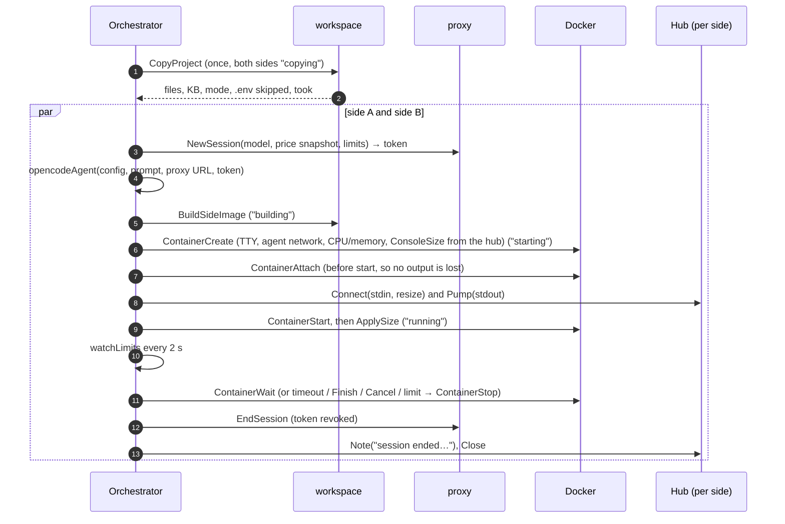
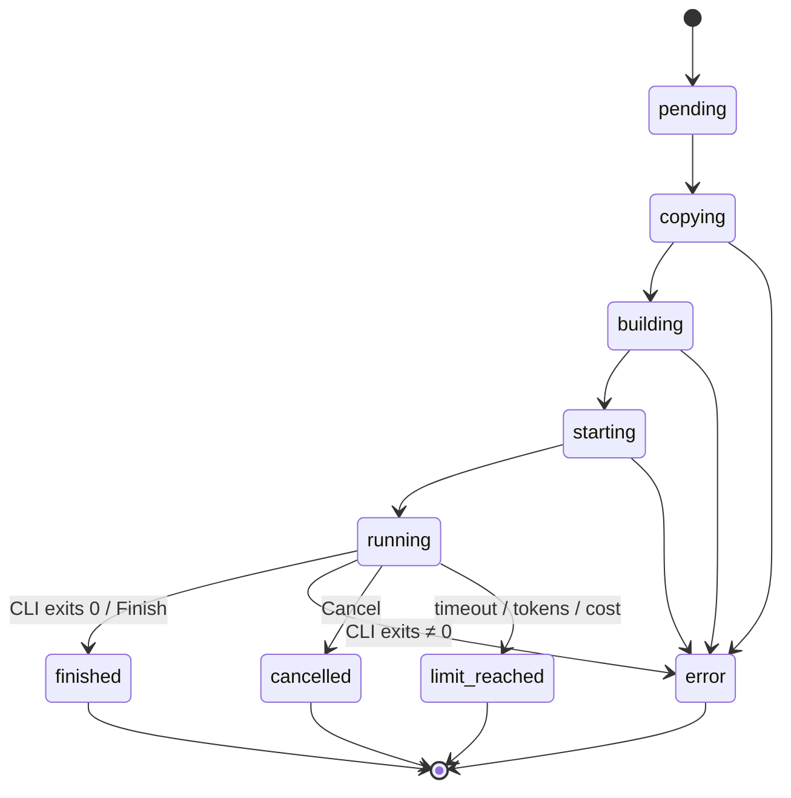

# 4. Comparison lifecycle

Code: `backend/internal/comparison/comparison.go` (orchestration), `store.go` (persistence), `agent.go` (the opencode adapter). Routes: `backend/cmd/server/comparisons.go`.

## Before the run: inspecting the project

The project is **optional**: the New comparison page offers "Copy a folder" or "Empty folder". With an empty folder there is nothing to inspect, the profile is the default runtime with no commands, and both sides start from an empty `/workspace` (the copy step only creates the empty folder).

When the user types a path, or picks one with **Browse…** (see [Project copy and side images](05-project-copy-and-images.md#the-folder-browser)), the browser calls `ProjectService.InspectProject`. `api` runs the copy helper with `inspect-project` (see [Project copy and side images](05-project-copy-and-images.md)), which reports without copying:

- whether it is a Git repository, how many files would be copied and their size;
- harness files at the root, and which CLI reads each one (`AGENTS.md` → opencode and codex, `CLAUDE.md` → claude…);
- `.env` files that will be left out;
- toolchain markers, from which `detectProfile` proposes a **profile**: runtime `node:22-bookworm-slim` and, depending on the lock file, a setup command (`npm ci`, `pnpm install --frozen-lockfile`, `yarn install --frozen-lockfile`) and a test command.

The runtime must contain Node.js for now, because opencode is installed with npm.

## Starting

`POST /api/comparisons` with:

```json
{
  "projectPath": "C:\\Users\\me\\projects\\app",
  "profile": { "runtime": "node:22-bookworm-slim", "setup": "npm ci", "test": "npm test", "hiddenTestsPath": "" },
  "prompt": "Add a CSV export to the invoices page",
  "sides": {
    "A": { "cli": "opencode", "provider": "openai", "model": "gpt-5.4-nano", "effort": "low", "mode": "autonomous",
           "limits": { "timeoutMin": 10, "maxTokensK": null, "maxCostUsd": 0.5 } },
    "B": { "cli": "opencode", "provider": "openai", "model": "gpt-5.4-mini", "effort": "low", "mode": "autonomous",
           "limits": { "timeoutMin": null, "maxTokensK": null, "maxCostUsd": null } }
  }
}
```

`Service.Start` validates (non-empty prompt, two models, `opencode` and `openai` only in phase 1), creates an id (`r` + 6 hex characters), creates both sides with status `pending` and a terminal hub each, **inserts them into Postgres**, starts `run` in a goroutine and returns `{"id": "…"}` at once. The browser navigates to `/comparisons/{id}`.

## The run



Step by step, per side (`runSide`):

1. **Price snapshot and proxy session.** The model's price (and long-context tier) is copied from the current catalogue into the side, and a proxy session is created with the limits converted to absolute numbers (`maxTokensK × 1000`, `maxCostUsd`). The session returns a random `aic_…` token.
2. **Agent definition.** `opencodeAgent` produces the install command, the config file to put in the home folder, the environment (`OPENAI_API_KEY=<token>`) and the command line. See [Agent CLIs](13-agent-clis.md).
3. **Image build** (`building`). One image per side, tagged `ai-compare/side:<id>-<side>`. Both sides build in parallel; Docker's layer cache makes the second build and later comparisons fast.
4. **Container creation** (`starting`). TTY with stdin open, on the agent network, with `NanoCPUs = 2 CPUs` and `Memory = 4 GB` for each side, and labels `ai-compare.comparison`, `ai-compare.side`, `ai-compare.role=agent`. `ConsoleSize` is set from the size the browser terminal already reported, so the TUI draws for the right size from its first frame.
5. **Attach, then start.** Attaching before starting guarantees the first output is captured. After the start, the latest browser size is applied once more, in case the user resized while the container was starting.
6. **Running.** `runStartedAt` is recorded. The limit watcher starts. The orchestrator waits for the container to exit, or for the run context to end.
7. **Ending.** Whatever ends the side, the container is stopped (if still running), the attach is closed, the proxy token is revoked, a final note is written to the terminal, the hub is closed and the side is saved with its terminal output.

## Statuses



- `finished`, `error`, `cancelled` and `limit_reached` are **terminal**. The first terminal status wins: if the user presses Finish and the container then exits with code 137, the side stays `finished`.
- Each terminal status carries an **end reason** shown in the UI: "The CLI exited (code 0)", "Finished by the user", "Timeout of 10 min", "The cost limit was reached", "build failed: …", "ai-compare restarted while this side was running".
- **Finish** and **Cancel** (`POST /api/comparisons/{id}/sides/{side}/finish|cancel`) set the status first, then cancel the run context, which stops the container.
- **Timeout** is a `context.WithTimeout` on the run. **Token and cost limits** are detected by the watcher from the proxy session; the proxy itself already answers 403 to further requests.
- A failure in any step marks the side `error`, prints the error in red in its terminal, logs it and closes the hub.

## Timings and metrics

| Metric | Definition |
|---|---|
| `elapsedSec` | From the creation of the comparison to the end of the side (or now) |
| `prepSec` | From creation to `runStartedAt`: copy + build + start. Not counted against the agent |
| `phases.copySec` | Duration of the shared copy (same value on both sides) |
| `phases.buildSec` | Duration of this side's image build |
| `phases.startSec` | Container create + attach + start |
| `agentSec` | From `runStartedAt` to the end: the time the agent had |
| `humanWaitSec` | Interactive mode only; not measured yet |
| `usage`, `costUsd` | Sum over the proxy session's requests (see [Inference proxy](06-inference-proxy.md)) |
| `requests`, `errors` | Count of proxied requests, and those with a provider error or status ≥ 400 |
| `tokensPerSec` | Output tokens of streamed requests divided by their duration, once there is more than 1 s of data |

## Logs

Each side keeps log entries (`at`, `level`, `source`, `message`) with source `copy`, `build`, `run` or `proxy`. The orchestrator writes notes at each step (files copied, image built in N s, container started with its resources…); informational notes are also printed in the side's terminal in grey with the prefix `[ai-compare]`. `GET …/logs` merges them with one line per proxied request, sorted by time.

## Downloading the result

`GET /api/comparisons/{id}/sides/{side}/download` reads `/workspace` from the side container (running or stopped) through `CopyFromContainer` and streams it as a zip named `<model>-<id>-<side>.zip`, leaving out `.git` and `node_modules`. It works after an `api` restart as long as the container still exists.

## Persistence and restarts

Every status change and every end saves the side (`store.go`). On startup:

1. `Load` reads all comparisons and sides from Postgres. Each side gets a closed hub pre-filled with its saved terminal output, so the history shows the terminal read-only.
2. Sides that were not in a terminal status belonged to the previous process. They are marked `error` with the reason "ai-compare restarted while this side was <status>", their end time is their last save, and they are saved again.
3. `StopOrphans` stops every running container labelled `ai-compare.role=agent`, since nothing can follow them any more.

Reattaching to live containers after a restart (instead of closing them) is planned for phase 1a.

## Only one comparison at a time

The UI asks `GET /api/comparisons/active` (the newest comparison with a side not yet ended) and offers to return to it instead of starting another. The backend does not enforce this; it is a UI rule to keep runs fair and machines responsive.
