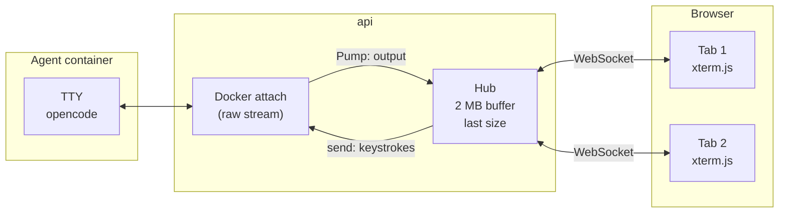

# 7. Terminals

Code: `backend/internal/terminal/hub.go` (the per-side hub), `terminal.go` (attach, the phase 0 bridge), `frontend/src/api/http.ts` (`websocketTerminal`), `frontend/src/components/terminal/TerminalView.tsx` (xterm.js).

## Goal

Each side's CLI is a full-screen TUI (opencode). The user must see it live, scroll it, type into it in interactive mode, resize it, close and reopen the tab without losing the screen, and later replay it from the history.

## The pieces

### Container side

- The container is created with `Tty: true`, `OpenStdin: true` and `AttachStdin/Stdout/Stderr: true`. With a TTY the attach stream is raw (not multiplexed), exactly what a terminal emulator expects.
- `TERM=xterm-256color`, `COLORTERM=truecolor` and `LANG=C.UTF-8` are set so TUIs use colours and Unicode.
- **Attach happens before start**, so the first frames are not lost.
- Keystrokes are written to the TTY as bytes. Ctrl+C arrives as `\x03` and the TTY turns it into SIGINT, as on a real terminal.
- Resizing calls `ContainerResize`, which sends SIGWINCH to the process.

### The hub

One `Hub` per side lives for the whole life of the side:

- **Buffer.** It keeps the last **2 MB** of output, so a viewer who connects later (a reopened tab, a second tab, the history) receives the screen so far before the live stream.
- **Fan-out.** Each viewer has a channel (512 chunks). A viewer that cannot keep up is dropped; reconnecting replays the buffer.
- **Input.** Keystrokes from any viewer go to the container. Several tabs can type into the same side.
- **Size.** It remembers the last size a viewer reported. Browsers usually connect before the container exists, so the orchestrator creates the container with that size (`ConsoleSize`) and applies it again right after start (`ApplySize`). Without this the TUI drew at 80×24 until the user switched tabs.
- **Notes.** ai-compare's own messages are written into the same stream in grey (`[ai-compare] …`), above the agent's output, so the terminal tells the whole story: copy, build, start, end reason.
- **Close.** When the side ends, input is disconnected and every viewer gets a normal WebSocket close "the session has ended". The buffer stays, so the final screen is still visible.

The hub's output is saved to Postgres when the side ends. After a restart, the side gets a closed hub pre-filled with it: the history shows the final terminal read-only.

## WebSocket protocol

`GET /api/comparisons/{id}/sides/{side}/terminal` (upgrade).

| Direction | Frame type | Content |
|---|---|---|
| Server → browser | binary | Raw TTY output (the buffer first, then live chunks) |
| Browser → server | binary | Keystrokes, UTF-8 |
| Browser → server | text | JSON control message: `{"type":"resize","cols":120,"rows":40}` |
| Server → browser | close 1000 | "the session has ended" |

The WebSocket only accepts same-origin connections (the default of `coder/websocket`), so another website open in the browser cannot connect to a terminal.

Connect is not used here: browsers do not support Connect's bidirectional streaming, and a terminal needs input and output at the same time with low latency.

## Browser side

`websocketTerminal(path)` returns a `TerminalSource` (`subscribe`, `send`, `resize`):

- output that arrives before anyone subscribes is kept and delivered on subscribe;
- the latest size is sent as soon as the socket opens;
- binary frames are decoded with a streaming `TextDecoder`, so multi-byte characters split across frames stay intact;
- closes and errors are written into the terminal in grey or red.

`TerminalView` renders it with **xterm.js 6** and the fit addon: dark theme matching the UI, IBM Plex Mono, 5,000 lines of scrollback, a `ResizeObserver` that refits and reports the size, and a second fit once fonts have loaded. Padding is on a wrapper element because the fit addon ignores its parent's padding. `readOnly` disables input (history).

`SideTerminal` creates the source keyed on comparison, side and read-only flag; switching tabs and back creates a new connection, which replays the buffer.

## Known limitations

- **Keyboard shortcuts captured by the host app.** Inside the Claude desktop app's browser pane, Ctrl+C is intercepted before it reaches the page. In a normal browser it works.
- **Recording format.** The plan calls for asciicast v2 (timed) recordings for replay. Today the raw output is saved, which shows the final screen but not the timing.
- **Size of the buffer.** Very long sessions keep only their last 2 MB.

## The phase 0 spike page

`/spike/terminal` (not in the navigation) opens `GET /api/spike/terminal?image=…`, which creates a throwaway container running `bash -l`, bridges it directly (without a hub) and removes it when the socket closes. It was used to validate typing, resizing and Ctrl+C.
