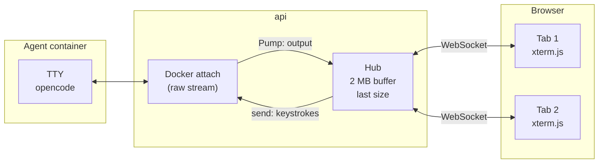

# 7. Terminals

Code: `backend/internal/terminal/hub.go` (the per-side hub), `cast.go` (the asciicast recorder), `terminal.go` (attach, the phase 0 bridge), `frontend/src/api/http.ts` (`websocketTerminal`), `frontend/src/components/terminal/TerminalView.tsx` (xterm.js) and `RecordingPlayer.tsx` (timed replay).

## Goal

Each side's CLI is a full-screen TUI (opencode). The user must see it live, scroll it, type into it in interactive mode, resize it, close and reopen the tab without losing the screen, and later replay it from the history with its original timing.

## The pieces

### Container side

- The container is created with `Tty: true`, `OpenStdin: true` and `AttachStdin/Stdout/Stderr: true`. With a TTY the attach stream is raw (not multiplexed), exactly what a terminal emulator expects.
- `TERM=xterm-256color`, `COLORTERM=truecolor` and `LANG=C.UTF-8` are set so TUIs use colours and Unicode.
- **Attach happens before start**, so the first frames are not lost.
- Keystrokes are written to the TTY as bytes. Ctrl+C arrives as `\x03` and the TTY turns it into SIGINT, as on a real terminal.
- Resizing calls `ContainerResize`, which sends SIGWINCH to the process.

### The hub

One `Hub` per side lives for the whole life of the side:

- **Buffer.** It keeps the last **2 MB** of output, so a viewer who connects later (a reopened tab, a second tab, the history) receives the screen so far before the live stream.
- **Fan-out.** Each viewer has a channel (512 chunks). A viewer that cannot keep up is dropped; reconnecting replays the buffer.
- **Input.** Keystrokes from any viewer go to the container. Several tabs can type into the same side. The hub also notes **when** the user typed (at most one time per second), which is what the human wait of interactive sides is computed from (see [Comparison lifecycle](04-comparison-lifecycle.md#timings-and-metrics)). These times are saved with the side.
- **Recording.** From the moment the container is attached, every output chunk and every resize is written to the side's recording (see below).
- **Size.** It remembers the last size a viewer reported. Browsers usually connect before the container exists, so the orchestrator creates the container with that size (`ConsoleSize`) and applies it again right after start (`ApplySize`). Without this the TUI drew at 80×24 until the user switched tabs.
- **Notes.** ai-compare's own messages are written into the same stream in grey (`[ai-compare] …`), above the agent's output, so the terminal tells the whole story: copy, build, start, end reason.
- **Close.** When the side ends, input is disconnected and every viewer gets a normal WebSocket close "the session has ended". The buffer stays, so the final screen is still visible.

The hub's output is saved to Postgres when the side ends. After a restart, an ended side gets a closed hub pre-filled with it (`Preload`): the history shows the final terminal read-only. A side that is **reattached** after a restart gets its screen back from the container's own log (`docker logs`, which with a TTY is the raw stream), preloaded into the hub without being recorded again; the output produced while `api` was down is then appended to the recording in one piece.

## Recordings

`terminal.Recorder` writes **asciicast v2** to `terminal.cast` in the side's artefacts folder (`<id>/<side>/`): a JSON header (`version`, `width`, `height`, `timestamp`), then one line per event, `[seconds, "o", output]` or `[seconds, "r", "COLSxROWS"]`. A chunk that ends in the middle of a multi-byte UTF-8 character is held back until the rest arrives, so every line is valid JSON text. A reattached side keeps appending to the same file.

`GET /api/comparisons/{id}/sides/{side}/recording` serves the file. In the history, the Terminal tab shows the final screen (from the hub over the WebSocket) with a **Replay with timing** button; `RecordingPlayer` then plays the output events into a read-only xterm.js at 1×, 2×, 4× or 16×, with pauses longer than 2 s shortened to 2 s as asciinema does. Resize events are left to the viewer's own size. The file is plain asciicast, so `asciinema play terminal.cast` works too.

## WebSocket protocol

`GET /api/comparisons/{id}/sides/{side}/terminal` (upgrade).

| Direction | Frame type | Content |
|---|---|---|
| Server → browser | binary | Raw TTY output (the buffer first, then live chunks) |
| Browser → server | binary | Keystrokes, UTF-8 |
| Browser → server | text | JSON control message: `{"type":"resize","cols":120,"rows":40}` |
| Server → browser | close 1000 | "the session has ended" |

The WebSocket only accepts same-origin connections (the default of `coder/websocket`), so another website open in the browser cannot connect to a terminal.

Connect is not used here: browsers do not support Connect's bidirectional streaming, and a terminal needs input and output at the same time with low latency.

## Browser side

`websocketTerminal(path)` returns a `TerminalSource` (`subscribe`, `send`, `resize`):

- output that arrives before anyone subscribes is kept and delivered on subscribe;
- the latest size is sent as soon as the socket opens;
- binary frames are decoded with a streaming `TextDecoder`, so multi-byte characters split across frames stay intact;
- closes and errors are written into the terminal in grey or red.

`TerminalView` renders it with **xterm.js 6** and the fit addon: dark theme matching the UI, IBM Plex Mono, 5,000 lines of scrollback, a `ResizeObserver` that refits and reports the size, and a second fit once fonts have loaded. Padding is on a wrapper element because the fit addon ignores its parent's padding. `readOnly` disables input (history).

`SideTerminal` creates the source keyed on comparison, side and read-only flag; switching tabs and back creates a new connection, which replays the buffer.

## Known limitations

- **Keyboard shortcuts captured by the host app.** Inside the Claude desktop app's browser pane, Ctrl+C is intercepted before it reaches the page. In a normal browser it works.
- **Size of the buffer.** Very long sessions keep only their last 2 MB in the live buffer and in the saved final screen. The recording has everything.
- **No automatic reconnection.** A closed terminal WebSocket is reported in the terminal; switching tabs or reloading opens a new connection, which replays the buffer.

## The phase 0 spike page

`/spike/terminal` (not in the navigation) opens `GET /api/spike/terminal?image=…`, which creates a throwaway container running `bash -l`, bridges it directly (without a hub) and removes it when the socket closes. It was used to validate typing, resizing and Ctrl+C.
