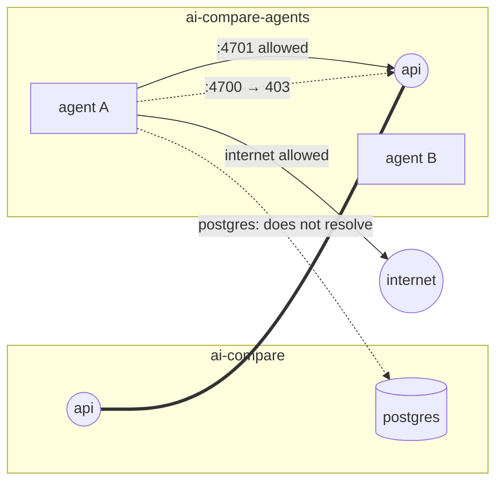

# 8. Networking and security

## Ports

| Port | Listener | Published on the host? | Who may use it |
|---|---|---|---|
| **4700** (`APP_PORT`) | UI, Connect API (including the event stream), terminal WebSockets, downloads and recordings | Yes, on **127.0.0.1 only** | The user's browser |
| **4701** (`PROXY_PORT`) | Inference proxy | **No** (`expose` only) | Agent containers, via `http://api:4701` |
| 5432 | PostgreSQL inside the `ai-compare` network | Yes, on **127.0.0.1:55432** (`POSTGRES_PORT`), only for running the backend outside Docker | `api` |
| 5173 | Vite dev server (`pnpm dev`) | Host process | Development only |

Whoever controls the app port controls Docker on the machine (it can create containers that mount host folders). That is why it is never published beyond localhost.

## Networks

- **`ai-compare`**: `api` and `postgres`.
- **`ai-compare-agents`**: `api` and the agent containers. `api` is the only Compose service on it, so `postgres` is not even resolvable from an agent.
- Agents **have internet access**, because they may need to install packages (`npm install`, `pip install`) as part of their work.
- **Verification containers have no network at all** (`NetworkMode: none`): the container that collects a side's result and the ones that run its tests cannot reach the internet, the proxy or the stack. A test suite cannot leak anything, phone home or depend on a live service.
- `host.docker.internal` is mapped to the host gateway (`extra_hosts`) for `api`, so the proxy can reach a local model server on the host on Linux too (Docker Desktop provides it natively on macOS and Windows).

### netguard: the app port refuses agents

Because `api` is on the agent network, an agent could in principle call `http://api:4700` and use the app's API (which can start containers). `internal/netguard` reads the subnets of `ai-compare-agents` at startup and wraps the whole app handler: any request whose source address is in those subnets gets **403** `{"error":"agent containers cannot use the ai-compare API"}`. The proxy listener on 4701 is not wrapped.

All of this is verified by `docker compose exec api /app/spike proxy-check` (see [Development](15-development.md)).

## Secrets

| Secret | Where it lives | Where it never goes |
|---|---|---|
| `OPENAI_API_KEY`, `ANTHROPIC_API_KEY` | Root `.env` (git-ignored), injected into `api` only | Agent containers, the browser, logs, the database |
| Side tokens (`aic_…`) | Memory of `api`, the env of one agent container, and the side's row in Postgres while it runs (so it can be reattached after a restart) | Revoked when the agent stops and emptied when the side ends; useless outside the proxy |
| The user's `.env` files | The user's project folder | Never copied into staging, images or containers (templates such as `.env.example` are kept) |
| Postgres password | `.env` / Compose defaults | Only meaningful on localhost |

The `api` image does not contain the `.env`; Compose passes it as environment variables (`env_file`, optional).

## What agents can and cannot do

| Can | Cannot |
|---|---|
| Read and write their own copy of the project (`/workspace`) | Touch the user's original folder (it was mounted read-only in a different, short-lived container) |
| Call the model through the proxy with their token | Learn the real API key |
| Reach the internet | Reach the app API (403) or Postgres (no DNS) |
| Use the CPUs and memory set in Settings (2 CPUs and 4 GB by default) | Use more than their quota (equal for both sides) |
| Run any command inside their container as `agent` (autonomous mode uses `--auto`) | Escape the container short of a Docker vulnerability |
| Leave files in `/workspace` that the tests will run | See the hidden tests, which are added only in a separate test container |

The container is the safety boundary for autonomous mode. Inside it the agent runs as the unprivileged user `agent` (home `/home/agent`), which owns `/workspace`; the profile's setup command runs as root while the image is built, before the image switches to that user. At run time, root is used only by ai-compare's own collection step, in a separate container without network.

## Browser-side protections

- The terminal WebSocket only accepts same-origin connections, so another site open in the browser cannot attach to a terminal.
- There is no authentication: the app is single-user and bound to localhost. A Jupyter-style session token was considered and postponed until the app is ever exposed beyond the local machine.

## Threat model in short

ai-compare assumes a single trusted user on their own machine. It protects against:

- **an agent misbehaving** (prompt injection in the project, a model doing something unexpected): it is confined to a container with a copy, a fake key, a budget and no access to the control plane;
- **accidental leaks**: keys and `.env` files never reach agents or providers;
- **other websites** in the same browser: localhost binding and same-origin WebSockets.

It does not protect against other local users or malware on the host, which could use the Docker socket directly anyway.

## What ai-compare removes from Docker

Retention, **Clean up now** and deleting a comparison remove only what ai-compare created for that comparison: containers labelled `ai-compare.comparison=<id>`, the images `ai-compare/side:<id>-a|b` and `ai-compare/result:<id>-a|b`, and its staging folder. No prune, no wildcard: the user's other containers, images and volumes are never touched. See [Comparison lifecycle](04-comparison-lifecycle.md#retention-and-deletion).
