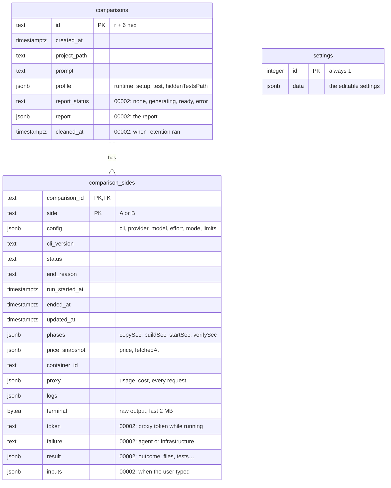

# 11. Database

PostgreSQL 17 in the Compose service `postgres`, data in the volume `pgdata`.

Code: `backend/internal/db/` (`postgres.go` is hand-written; the rest is generated), `backend/internal/comparison/store.go` (what is saved and when), `backend/internal/settings/settings.go`, `backend/sqlc.yaml`.

## Connection and migrations

At startup `main.go` calls `db.Open(ctx, DATABASE_URL, log)`:

1. creates a `pgxpool` connection pool;
2. pings until Postgres answers, for up to a minute (Compose also waits for the `postgres` health check);
3. applies pending migrations with **goose**, from SQL files **embedded in the binary** (`//go:embed migrations/*.sql`), and logs each one applied.

If `DATABASE_URL` is empty or the database is unreachable, the app **still starts** and keeps comparisons, reports and settings in memory only, with a log line saying so. `GET /api/health` reports `"database": "ok"`, the error, or `"not configured"`.

Inside Docker, Compose sets `DATABASE_URL=postgres://…@postgres:5432/…`. When the backend runs on the host, the `.env` points at `localhost:55432`.

### Adding a migration

Create `backend/internal/db/migrations/0000N_description.sql`:

```sql
-- +goose Up
ALTER TABLE comparison_sides ADD COLUMN example text NOT NULL DEFAULT '';

-- +goose Down
ALTER TABLE comparison_sides DROP COLUMN example;
```

Then run `pnpm gen` so sqlc sees the new schema. The next start applies it.

## Queries with sqlc

SQL lives in `backend/internal/db/queries/*.sql` with sqlc annotations (`-- name: SaveSide :exec`). `pnpm gen` turns them into typed Go functions on `db.Queries` (`queries.go`, `models.go`, `comparisons.sql.go`, `settings.sql.go`) using the **pgx/v5** driver. `sqlc.yaml` maps `timestamptz` to `time.Time` (or `*time.Time` when nullable) instead of pgx types.

sqlc reads the migrations as the schema, so the queries are checked against the real tables when generating.

## Schema

Two migrations: `00001_comparisons.sql` (phase 0) and `00002_phase1.sql`, which adds the columns marked below and the `settings` table.



| Column (00002) | Contents |
|---|---|
| `comparison_sides.token` | The side's proxy token while it runs, so a restarted `api` can reattach to its container with the same token. Emptied when the side ends |
| `comparison_sides.failure` | For status `error`: `agent` or `infrastructure` |
| `comparison_sides.result` | `comparison.Result`: `outcome` (with its reason and failure kind), `agentEndedAt`, `files`, `harnessFiles`, `tests`, `hasResult`, `hasRecording`, `humanWaitSec`, `sessionUsage`, `sessionCostUsd` |
| `comparison_sides.inputs` | The times the user typed into the terminal, for the human wait |
| `comparisons.report_status`, `report` | The report's status and content (`report.Report` as JSON) |
| `comparisons.cleaned_at` | When retention removed the comparison's containers, images and staging copy |
| `settings` (one row, `id = 1`) | `settings.Settings` as JSON: default limits, report model, automatic report, CPUs, memory, retention days. Without a row the defaults apply |

JSON columns hold the same structures the backend works with (`comparison.SideConfig`, `Phases`, `PriceSnapshot`, `Result`, `proxy.Snapshot`, `[]LogEntry`, `report.Report`, `settings.Settings`). That keeps the schema small while the shapes are still changing; columns can be promoted out of JSON when something needs to query them.

Large artefacts are **not** in the database: diffs, test output, CLI sessions, the side's files and terminal recordings are files in the `ai-compare_artifacts` volume under `<id>/<side>/` (see [Comparison lifecycle](04-comparison-lifecycle.md#verification)); the side's `result` says whether they exist.

Queries: `InsertComparison`, `InsertSide`, `SaveSide`, `SaveReport`, `MarkCleaned`, `DeleteComparison` (sides go with it, `ON DELETE CASCADE`), `ListComparisons`, `ListSides`, `GetSettings`, `SaveSettings`.

## When things are saved

| Moment | What |
|---|---|
| `Start` | The comparison row and both side rows (status `pending`), before anything runs. If this fails, the comparison is not started |
| Every status change | The side's status, reason, failure kind, times, phases, price snapshot, container id, logs, current proxy snapshot, token, result and input times |
| Every 10 s while a side runs | The same, so a restart loses at most 10 s of proxy requests |
| A side ends (normally or by failure) | All of the above plus the terminal output; the token is emptied |
| Report status changes | `report_status` and `report` |
| Retention cleans a comparison | `cleaned_at` |
| Settings are changed | The `settings` row |
| Startup | Sides left mid-preparation are closed as `error` and saved again; reattached and re-verified sides carry on saving as usual |

Saves for one side are serialised by a per-side mutex, so a slower earlier save never overwrites a newer state. A failed save is logged and does not stop the run.

## Planned

The plan's full model adds `projects`, `side_transitions` (every status change with its time), `requests` (one row per proxied request) and `findings` as tables. Today requests live in the side's `proxy` JSON and findings in the report's JSON; promote them when something needs to query them.
