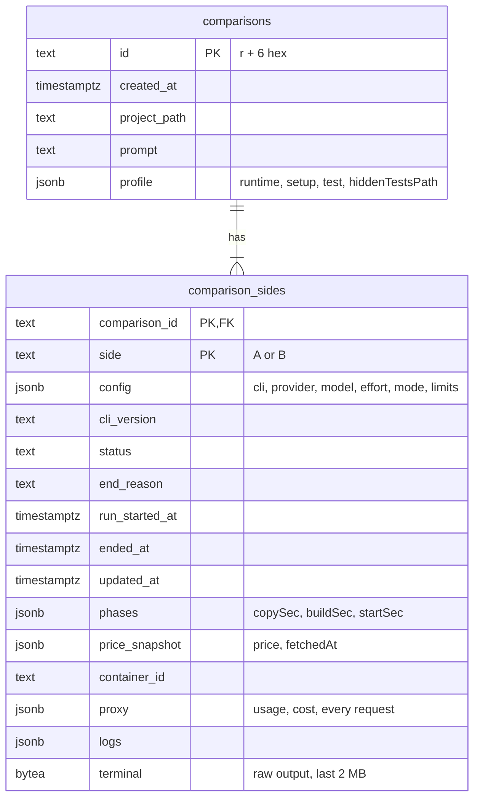

# 11. Database

PostgreSQL 17 in the Compose service `postgres`, data in the volume `pgdata`.

Code: `backend/internal/db/` (`postgres.go` is hand-written; the rest is generated), `backend/internal/comparison/store.go` (what is saved and when), `backend/sqlc.yaml`.

## Connection and migrations

At startup `main.go` calls `db.Open(ctx, DATABASE_URL, log)`:

1. creates a `pgxpool` connection pool;
2. pings until Postgres answers, for up to a minute (Compose also waits for the `postgres` health check);
3. applies pending migrations with **goose**, from SQL files **embedded in the binary** (`//go:embed migrations/*.sql`), and logs each one applied.

If `DATABASE_URL` is empty or the database is unreachable, the app **still starts** and keeps comparisons in memory only, with a log line saying so. `GET /api/health` reports `"database": "ok"`, the error, or `"not configured"`.

Inside Docker, Compose sets `DATABASE_URL=postgres://…@postgres:5432/…`. When the backend runs on the host, the `.env` points at `localhost:55432`.

### Adding a migration

Create `backend/internal/db/migrations/0000N_description.sql`:

```sql
-- +goose Up
ALTER TABLE comparison_sides ADD COLUMN example text NOT NULL DEFAULT '';

-- +goose Down
ALTER TABLE comparison_sides DROP COLUMN example;
```

Then run `pnpm gen` so sqlc sees the new schema. The next start applies it.

## Queries with sqlc

SQL lives in `backend/internal/db/queries/*.sql` with sqlc annotations (`-- name: SaveSide :exec`). `pnpm gen` turns them into typed Go functions on `db.Queries` (`queries.go`, `models.go`, `comparisons.sql.go`) using the **pgx/v5** driver. `sqlc.yaml` maps `timestamptz` to `time.Time` (or `*time.Time` when nullable) instead of pgx types.

sqlc reads the migrations as the schema, so the queries are checked against the real tables when generating.

## Schema



JSON columns hold the same structures the API returns (`comparison.SideConfig`, `Phases`, `PriceSnapshot`, `proxy.Snapshot`, `[]LogEntry`). That keeps the schema small while the shapes are still changing; columns can be promoted out of JSON when something needs to query them.

## When things are saved

| Moment | What |
|---|---|
| `Start` | The comparison row and both side rows (status `pending`), before anything runs. If this fails, the comparison is not started |
| Every status change | The side's status, reason, times, phases, price snapshot, container id, logs and current proxy snapshot |
| A side ends (normally or by failure) | All of the above plus the terminal output |
| Startup, for sides left mid-run | Closed as `error` and saved again |

Saves for one side are serialised by a per-side mutex, so a slower earlier save never overwrites a newer state. A failed save is logged and does not stop the run.

## Planned

The plan's full model adds `projects`, `side_transitions` (every status change with its time), `requests` (one row per proxied request), `reports` and `findings`, and moves large artefacts (diffs, recordings, test output) to files in the `artifacts` volume with only paths in the database.
