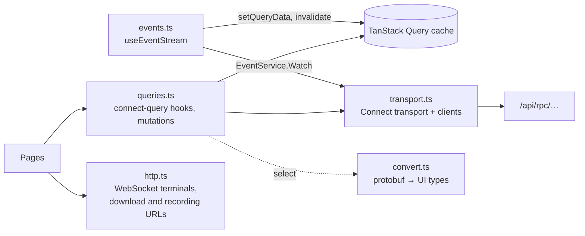

# 12. Frontend

`frontend/` — React 19, TypeScript 6, Vite 8, Tailwind CSS v4, shadcn/ui (Radix), TanStack Router and Query, connect-query, xterm.js 6.

## How it is served

- **In Docker** (normal use): `infra/docker/api.Dockerfile` builds the app in a Node stage (`pnpm --filter frontend build`) and copies `dist/` to `/app/web` in the final image. `api` serves those files and falls back to `index.html` for client-side routes, so `/history/r1c5860` loads the app.
- **In development**: `pnpm dev` runs Vite on port 5173, reading the root `.env`. Vite proxies `/api` (WebSockets included) to the backend on `APP_PORT`.

## Structure

| Path | Role |
|---|---|
| `src/main.tsx` | React root with connect-query's `TransportProvider`, `QueryClientProvider` and `RouterProvider` |
| `src/router.tsx` | Routes, declared in code (no file-based routing) |
| `src/components/app/AppShell.tsx` | Left navigation (top bar on narrow screens), the page outlet, and the status bar: the event stream state ("● live", "reconnecting…"), the active run, the catalogue |
| `src/pages/` | One component per page |
| `src/components/compare/SideForm.tsx` | One side's settings: CLI, provider, model, effort, mode, optional limits |
| `src/components/compare/artifacts.tsx` | The per-side tabs: Terminal (with replay), Logs, Changes, Metrics, Tests (visible and hidden runs), Events (with the usage cross-check) |
| `src/components/compare/HarnessView.tsx` | The Harness tab: the harness files the side ran with, read-only (file list and content, Markdown rendered); if the agent changed harness files, a warning and their diff |
| `src/components/compare/DiffView.tsx` | The Changes tab: the solution diff (harness files excluded; the Harness tab shows their diff), one collapsible section per file, all collapsed at first (sticky headers, expand/collapse all); generated files (lock files, `dist/`, `build/`, `.min.js`, diffs over 400 lines) are marked; a note counts the files left out in dependency folders |
| `src/components/terminal/TerminalView.tsx` | xterm.js wrapper |
| `src/components/terminal/RecordingPlayer.tsx` | Timed replay of a side's asciicast recording |
| `src/components/common/primitives.tsx` | Small shared pieces: `Metric`, `Dot`, `ErrorNote`… |
| `src/components/ui/` | shadcn components (generated by the shadcn CLI, then owned by the project) |
| `src/api/` | Everything about talking to the backend (see below) |
| `src/lib/format.ts` | en-GB formatting: dates, durations, integers, USD (two significant digits under a cent), rates |
| `src/lib/catalog.ts` | Which models agents can use, default effort, release date formatting |
| `src/gen/` | Generated protobuf code (do not edit) |

## Data layer

| File | Role |
|---|---|
| `transport.ts` | The Connect transport (`useHttpGet: true`, so read-only methods are GETs) and one client per service |
| `queries.ts` | Query hooks with `@connectrpc/connect-query` (`useQuery(Service.method.x, input)`), whose cache keys come from the generated method descriptors; mutations with TanStack Query's `useMutation` calling the clients; helpers to match keys by method and comparison id |
| `events.ts` | `useEventStream`: keeps `EventService.Watch` open and turns its events into cache updates |
| `convert.ts` | Maps protobuf messages to the plain types in `types.ts` (and settings and side configs back), used in each query's `select` |
| `types.ts` | The plain types pages work with |
| `http.ts` | What is not Connect: the WebSocket terminal source, and the download and recording URLs |

**Nothing polls.** `useEventStream` is mounted once, in `AppShell`'s status bar, which shows "● live" while the stream is open and "reconnecting…" otherwise. For each event:

- a `comparison` is written straight into the `GetComparison` cache entry for its id, and the `GetActiveComparison` entry follows the newest live comparison (or is cleared when it ends);
- while the comparison is live, its `GetLogs` queries are invalidated (new notes and proxy requests arrive all the time);
- when a side's status changes, its `GetLogs`, `GetDiff`, `GetTests` and `GetTimeline` queries and the `ListComparisons` list are invalidated;
- when the report status changes, `GetReport` and the list are invalidated;
- a `deleted_id` removes that comparison from the cache and invalidates the list.

The server sends a first message as soon as the stream opens; when it arrives the stream is marked live. If the stream drops, it reconnects with a back-off of up to 10 s; after a reconnect **every connect-query query is invalidated**, so whatever changed in between is refetched. The Changes tab of a running side is the one view that reads on demand: it loads the live diff when opened and has a refresh button.

Defaults set in `main.tsx`: one retry, no refetch on window focus. There is no mock client and no sample data, except the presets of the `/harnesses` preview (`pages/harnesses/samples.ts`).

## Pages

| Page | Notes |
|---|---|
| `NewComparisonPage` | Waits for settings and catalogue; "Copy a folder" (typed path or the **Browse…** folder browser, `components/compare/FolderBrowser.tsx`) or "Empty folder"; inspects the path; shows harness files and excluded `.env` files; editable profile with an optional hidden tests folder; both sides default to autonomous mode, the newest models and the default limits from settings, with the suggested values offered when a limit is switched on; refuses to start a second comparison while one is active ; `/?from=<id>` (the history's **Run again**) fills the form with an earlier comparison: project (checked again) or empty folder, the profile it ran with, prompt and both sides, warning if a model left the catalogue |
| `RunPage` | Exactly one screen high on desktop (the app shell is `h-dvh` and pages scroll inside `main`), two panes side by side from `xl`, each tab scrolling on its own (stacked below `xl`, each pane 85% of the screen); status, prep sub-label (copy, build, start), live tokens, cost and tok/s; Finish, Cancel and Download per side; tabs Terminal, Logs, Changes (live while running), Metrics, Tests, Events and a disabled Preview (phase 2); the report bar at the bottom (Generate report, progress, link to the report) |
| `HistoryPage` | Ended comparisons grouped by date |
| `ReportPage` | Comparison detail: result and configuration of both sides, the report (verdicts, conclusions, per-side analysis, findings by severity, warnings, its model and cost, or its error with Generate again); downloads of A and B; Delete; per-side tabs Terminal (final screen and **Replay with timing**), Logs, Changes, Tests, Events |
| `PricingPage` | models.dev data per provider |
| `SettingsPage` | Provider keys (read-only), default limits, report model and automatic report, CPUs and memory per side, retention days with **Clean up now**, disk use, CLI versions (pinned and latest), local model server URL (read-only). Number fields save when they lose focus or Enter is pressed; the rest saves on change |
| `pages/SeriesPage.tsx` | A series (`/series/<id>`): the sides' configuration, aggregates per side, the cost versus quality chart (SVG) and every attempt with a link; Stop the series while attempts are pending |
| `components/compare/PreviewView.tsx` | The Preview tab: start or stop the side's preview, its status, an iframe of `<side>-<id>.localhost`, a link to open it in a new tab, and the error and output when it fails |
| `HarnessesPage` | Presets: list with search and the fixed **No harness** card; creation with details and import from a project (folder browser, detected harness files); detail with categories, a file tree for `project/` and `home/`, drop zones for files and folders (`.env` files are skipped), Markdown rendering (react-markdown), an editor that checks JSON and TOML (smol-toml) before saving, new file, rename or move, delete, duplicate, edit details and notes, and a link to the history filtered by the preset |
| `SpikeTerminalPage` | `/spike/terminal`, not in the navigation |

## Styling: "Consola"

A dark, IDE-like style chosen from several mockups ([`mockups/`](../mockups)):

- design tokens as CSS variables in `src/index.css` (Tailwind v4 `@theme`), including `--side-a` and `--side-b` colours that identify each side everywhere (tabs, logo, badges);
- IBM Plex Sans for the UI and IBM Plex Mono for terminals, numbers and code, self-hosted through `@fontsource`;
- editor-style tabs whose active tab has a top border in the side's colour;
- reading pages (history, report) use softer contrast and more spacing than the run screen.

shadcn was initialised with the `lyra` preset (Radix primitives, lucide icons). Components are copied into `src/components/ui` and can be edited freely.

## Conventions

- British English in every string and identifier.
- `@/` is an alias for `src/`.
- Lint with **oxlint** (`pnpm lint`); type-check with `tsc -b` (part of `pnpm build`).
- No routing or data logic in `components/ui`.
