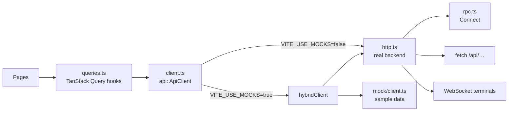

# 12. Frontend

`frontend/` — React 19, TypeScript 6, Vite 8, Tailwind CSS v4, shadcn/ui (Radix), TanStack Router and Query, xterm.js 6, Connect clients.

## How it is served

- **In Docker** (normal use): `infra/docker/api.Dockerfile` builds the app in a Node stage (`pnpm --filter frontend build`) and copies `dist/` to `/app/web` in the final image. `api` serves those files and falls back to `index.html` for client-side routes, so `/history/r1c5860` loads the app.
- **In development**: `pnpm dev` runs Vite on port 5173, reading the root `.env`. Vite proxies `/api` (WebSockets included) to the backend on `APP_PORT`.

## Structure

| Path | Role |
|---|---|
| `src/main.tsx` | React root with `QueryClientProvider` and `RouterProvider` |
| `src/router.tsx` | Routes, declared in code (no file-based routing) |
| `src/components/app/AppShell.tsx` | Left navigation (top bar on narrow screens), the active-run indicator, the page outlet |
| `src/pages/` | One component per page |
| `src/components/compare/SideForm.tsx` | One side's settings: CLI, provider, model, effort, mode, optional limits |
| `src/components/compare/artifacts.tsx` | The per-side tabs: Terminal, Logs, Changes (diff), Metrics, Tests, Events |
| `src/components/terminal/TerminalView.tsx` | xterm.js wrapper |
| `src/components/common/primitives.tsx` | Small shared pieces: `Metric`, `Dot`, `ErrorNote`… |
| `src/components/ui/` | shadcn components (generated by the shadcn CLI, then owned by the project) |
| `src/api/` | Everything about talking to the backend |
| `src/lib/format.ts` | en-GB formatting: dates, durations, integers, USD (two significant digits under a cent), rates |
| `src/lib/catalog.ts` | Which models agents can use, default effort, release date formatting |
| `src/gen/` | Generated protobuf code (do not edit) |

## Data layer

- **`ApiClient`** (`client.ts`) is the interface for everything the UI needs. There are two implementations: `httpClient` (real) and `mockClient` (in memory).
- **`hybridClient`** is used while `VITE_USE_MOCKS=true` (the default in the Docker build). It sends to the real backend what the backend implements (catalogue, inspection, starting and following comparisons, finish/cancel, logs, terminals, the history of real runs) and serves the rest from sample data (reports, presets, settings, diffs, tests, events, sample history). Real comparison ids start with `r`, which is how it decides per call.
- **Hooks** (`queries.ts`) wrap each call with TanStack Query. Query keys live in one `keys` object. Defaults set in `main.tsx`: one retry, no refetch on window focus (individual queries opt in). Polling rules:
  - a live comparison refetches every second;
  - the active comparison is polled only while it is live; with nothing running it is fetched on mount and when the tab regains focus;
  - a report refetches every second while it is being generated.
- **Types** (`types.ts`) mirror the backend JSON. Catalogue data comes through `rpc.ts`, which maps protobuf messages to these same types, so pages do not care which transport was used.

## Pages

| Page | Notes |
|---|---|
| `NewComparisonPage` | Waits for settings and catalogue; "Copy a folder" (typed path or the **Browse…** folder browser, `components/compare/FolderBrowser.tsx`) or "Empty folder"; inspects the path; shows harness files and excluded `.env` files; editable profile; both sides default to autonomous mode and the newest models; refuses to start a second comparison while one is active |
| `RunPage` | Full-height layout with two panes; status, prep sub-label (copy, build, start), live tokens, cost and tok/s; Finish, Cancel and Download per side; the report bar at the bottom |
| `HistoryPage` | Comparisons grouped by date |
| `ReportPage` | Comparison detail and the report (sample data for now) |
| `PricingPage` | models.dev data per provider |
| `HarnessesPage`, `SettingsPage` | Sample data (phase 2 and later in phase 1) |
| `SpikeTerminalPage` | `/spike/terminal`, not in the navigation |

## Styling: "Consola"

A dark, IDE-like style chosen from several mockups ([`mockups/`](../mockups)):

- design tokens as CSS variables in `src/index.css` (Tailwind v4 `@theme`), including `--side-a` and `--side-b` colours that identify each side everywhere (tabs, logo, badges);
- IBM Plex Sans for the UI and IBM Plex Mono for terminals, numbers and code, self-hosted through `@fontsource`;
- editor-style tabs whose active tab has a top border in the side's colour;
- reading pages (history, report) use softer contrast and more spacing than the run screen.

shadcn was initialised with the `lyra` preset (Radix primitives, lucide icons). Components are copied into `src/components/ui` and can be edited freely.

## Conventions

- British English in every string and identifier.
- `@/` is an alias for `src/`.
- Lint with **oxlint** (`pnpm lint`); type-check with `tsc -b` (part of `pnpm build`).
- No routing or data logic in `components/ui`.
