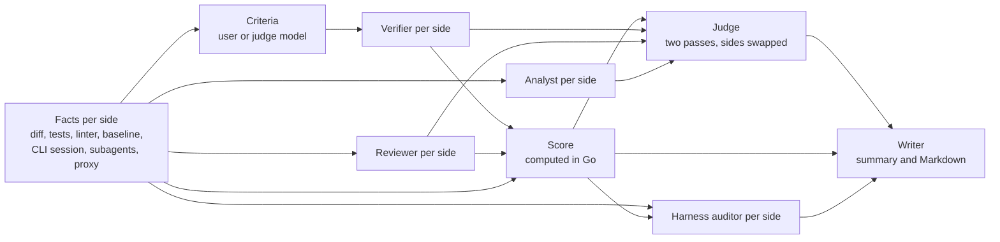

# 20. Reports

Code: `backend/internal/report/` (stages, scoring, Markdown), `backend/internal/comparison/` (the facts each stage reads: tests, linter, baseline, sessions, subagents, the first request), `backend/internal/proxy/` (per-request usage and the first request body), `frontend/src/pages/ReportPage.tsx` and `frontend/src/components/report/`. Design mockup: `mockups/report-mockup.html`.

The report answers one question: **which side did the task better, and why**. A cheap, fast side that does not do the task must never win. So the report checks what each side did against what was asked, scores it with fixed rules, and only then lets a judge weigh the rest.

## Overview

| Stage | Model | Output |
|---|---|---|
| Criteria (only when the user gave none) | Judge model | Acceptance criteria written from the prompt, without seeing any result |
| Verifier, per side | Judge model | Each criterion: met, partial, not met or not verifiable, with the method (ran or read) and the evidence (file:line, test, output) |
| Reviewer, per side, blind | Judge model | Problems (high, medium, low) and strengths, each with a location; what it could not review |
| Analyst, per side | Judge model | What happened in the run, facts apart from inferences |
| Score | none, Go code | 0 to 100 per side, with every line of the breakdown |
| Judge | Judge model | Winner, confidence, reasons, would ship, disagreements with the score |
| Harness auditor, per side | Judge model | Strengths, gaps and suggestions for that side's harness, with token savings |
| Writer | Report model | The headline, and the Markdown export |

**Models** are chosen in `/settings`: the **judge model** (default `gpt-6.1-sol`) does every stage that reasons; the **report model** (default `gpt-6-luna`) only writes. Both lists include OpenAI and Anthropic models. Agents themselves are better with a reasoning model; the report's writing does not need one.

## Acceptance criteria

What the result must do to count as done. They are optional and set **before** the comparison starts, on the new comparison page:

- **Generate from the prompt** asks the judge model for a list; the user can also write the list by hand, edit it, reorder it and set each item's importance: **required** or **desirable**.
- Once the comparison starts, the criteria are fixed (saved with it). **Run again** copies them.
- The agents never see them: the task is exactly the prompt.
- Left empty, the judge model writes them when the report is generated, from the prompt only, and the report says so.

Required criteria are gates (see below).

## The facts each side is checked against

| Fact | Source |
|---|---|
| Tests | The profile's test command, run in a fresh container of the side's result image |
| Linter | The profile's **lint command** (new, optional), run the same way |
| **Baseline** | The same tests and linter on the original project (the side image before the agent), run once per comparison: a failure that already existed is not the agent's |
| New tests | Test files the agent added or changed (`*.test.*`, `*.spec.*`, `test_*.py`, `*_test.go`, files under `test/`, `tests/`, `__tests__/`) |
| Hidden tests | Optional, as before: a folder of tests the agent never sees, added to the result and run |
| CLI session | Every session of the run, **subagents included**: messages, tokens (reasoning apart), cost, tools, task calls |
| Proxy | Every model request: time, model, tokens, cost, status, long-context price, errors, retries |
| First request | The body of the first request of the main agent, to measure what the harness costs |

## Gates

A side that fails a gate cannot win, whatever its score.

| Gate | Fails when |
|---|---|
| Finished | The side ended in error, hit a limit, was cancelled, or its last message is a question |
| Made changes | The diff is empty |
| Broke nothing | A test or the linter fails that passed on the baseline |
| Required criteria | A required criterion is "not met" (partial does not fail the gate) |

If both sides fail gates, the one that passes more of them is ahead, and the report says plainly that neither did the task.

## Score

Each side gets 0 to 100, computed by `report.Score` from the facts and the stages' structured answers. Models check evidence; they never pick the number.

### Functionality · 45

**Acceptance criteria · 30.** Required counts ×2, desirable ×1. Met counts 1, partial 0.5, not met 0. Not verifiable is left out of both the total and the weight. Points = 30 × achieved ÷ possible.

**Tests and linter · 15.**

| Part | Points | Rule |
|---|---|---|
| Existing tests still pass | 8 | Every test that passed on the baseline passes on the result. Without existing tests, these points go to the next line |
| New tests that pass | 4 (12 without existing tests) | The agent added or changed tests, and the test command passes |
| Linter clean | 3 | The lint command passes. Without a lint command, these points go to the criteria (which then weigh 33), and the reviewer weighs consistency and style under Code quality |

### Code quality · 25

Starts at 20. Each problem from the reviewer subtracts: high 8, medium 3, low 1. Each strength adds 1, up to 5. Problems and strengths must name a location. Result clamped to 0–25.

The reviewer looks for bugs, functional failures, unhandled edge cases, security problems, bad practices against common principles (single responsibility, duplication, leaky abstractions, error handling), readability (names, function size, structure) and test quality.

### Process · 10

From the CLI session. Starts at 10:

| Rule | Points |
|---|---|
| A command that failed and was not fixed later (same command run again successfully, or the error addressed) | −2 each, up to −6 |
| The last message is a question instead of a finished task | −2 |
| More than 20 % of tool calls failed | −2 |

### Efficiency · 20

Only counts when Functionality is at least 27; otherwise 0. Cost 10 and agent time 10: the better side gets 10, the other 10 × better ÷ its own. Efficiency is relative to the other side, so a score is fully comparable within a comparison or a series, and only roughly across comparisons.

## Not verified

Everything the stages could not check is listed, never left out quietly: criteria marked not verifiable and why, files the reviewer could not read in full (too long, generated), checks that did not run (no test command, no linter, no hidden tests), and anything an agent claims that the facts cannot confirm.

## Judge

Receives, with the sides anonymised (no model, CLI or harness names): the gates, the criteria with their evidence, the score breakdown, the review, the analyses and the metrics.

Rules: respect the gates; cite evidence for every claim; do not recompute the score. If it thinks the score is wrong, it says so as a **disagreement** with its reason.

It runs **twice with the sides swapped**. If both passes pick the same winner, confidence is the judge's own; if they differ, confidence is **low** and the report shows both.

Output: winner (A, B or tie), confidence (high, medium, low), reasons, "would ship" per side with a reason, verdict labels (Works, Code quality, Cheaper, Faster, Overall) and disagreements.

## Harness cost

Measured on the **first request of the main agent** (the proxy keeps its body). The prompt is split into parts:

| Part | What it is |
|---|---|
| CLI system prompt | The CLI's own instructions and environment |
| Tool definitions | The tools the CLI offers, without the skill list |
| Harness instructions | Text of the side's harness files found in the request (AGENTS.md, rules…) |
| Skills list | Names and descriptions of the available skills |
| Prompt | The user's prompt (and the autonomous note) |

The request's total input tokens are exact (from the provider); each part's share is estimated by its share of characters. The harness parts are sent **again on every request**, so the report shows: harness tokens per request, how many requests carried them, the total, how much came from the cache, the cost attributable to the harness, the skills loaded during the run with their size, and the largest harness files.

## Subagents

opencode runs subagents through its `task` tool; each one is a child session. Child sessions do not appear in `opencode session list`, so `collect-result.sh` exports them by the ids found in the task calls (recursively). For each subagent: type (`general`, `explore` or one defined in the harness), the task's description, model, tokens, cost, time, tools and result; and the share of the side's cost.

## Session

From the CLI session and the proxy:

- context size per request over time (a chart);
- cost per request (a chart);
- reasoning: how many steps reasoned and how many tokens (a chart per request);
- input served from the cache;
- tools used, with the failed ones;
- wasted work: failed tool calls, edits undone;
- time to the first edit;
- provider reliability: errors, 429s and retries, apart from the agent's merit;
- requests priced at the long-context rate (prompts over the model's threshold, 200k for most).

## Harness auditor

A separate stage per side, focused only on the harness. It reads that side's harness files with their measured cost per request, the session (what the agent quoted, followed, loaded or ignored) and the results (gates, criteria, review), and returns:

- **strengths**: what in the harness helped, with evidence;
- **gaps**: what went wrong that a harness instruction could have prevented;
- **suggestions**, each with a kind (add a rule, add a skill, compact a file, split a skill, move rules into skills, remove), the file, the change and the estimated token saving per request.

It runs for every side, also with no harness (then it suggests what to create).

## Your verdict

On the report the user can mark the judge as right, say the other side was better, or call it a tie, with a note. It is saved with the report and shown in the history, to tune the judge and the weights over time.

## Markdown export

**Export Markdown** downloads the report as a Markdown file: verdict, gates, score with its breakdown, criteria, review, not verified, harness cost and audit, subagents and the main session figures.

## Where it is stored

| What | Where |
|---|---|
| Criteria | `comparisons.criteria` (JSON), with who wrote them |
| Baseline | `comparisons.baseline` (JSON) |
| Lint result | The side's `result` (JSON), next to the tests |
| First request | `<id>/<side>/first-request.json` in the artefacts volume |
| Subagent sessions | Inside `<id>/<side>/session.json`, with the main session |
| The report | `comparisons.report` (JSON), including the score, the judge's passes and the audit |
| Your verdict | `comparisons.user_verdict` (JSON), kept when the report is generated again |
